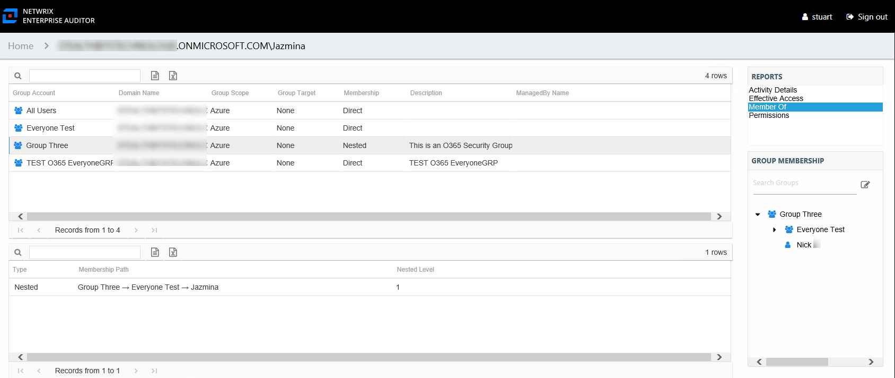
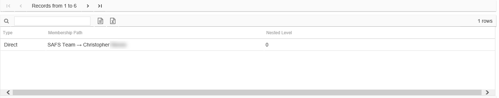

# Member Of Report for Entra ID User

The Member Of report for a user object provides a list of all groups of which the audited Entra ID (formerly Azure Active Directory) user is a member. This report includes a Membership Paths table.

This report is comprised of the following columns:

* Group Account – Account associated with the group
* Domain Name – Name of the domain
* Group Scope – Scope of the group object: Domain Local, Global, or Universal
* Group Target – Not applicable to Entra ID. The value will always be None.
* Membership – Type of membership the audited object has to the selected group

  * Direct – Object is specifically assigned to this group
  * Nested – Object is a member of a group which has membership in this group
* Description – Description of this group from Entra ID
* ManagedBy Name – Name of manager for the group from Entra ID

Since this report is a list of Entra ID groups, the Group Membership pane displays the group membership, including nested groups.

There is one table at the bottom displaying Membership Paths for the select group. It contains all of the ways the audited user has been granted membership to the selected group.

* Type – Type of membership the audited object has to the selected groupType of membership the audited user has to the selected group

  * Direct – Object is specifically assigned to this group
  * Nested – Object is a member of a group which has membership in this group
* Membership Path – Displays location for the audited object’s membership to the selected group, starts with group and ends with user

  * For Direct Membership – Path is [Group Name] > [User Name]
  * For Nested Membership – Path is [Group Name] > [Name of Nested Group] > [User Name]
* Nested Level – Count of groups nested between the selected group and the audited object’s direct membership