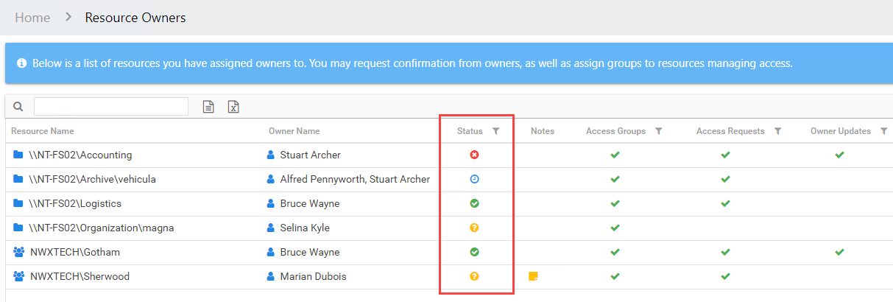

# Ownership Confirmation

The reason for assigning owners to resources is to enable business data owners to manage access to those resources without requiring IT Administrative privileges. In order for this to work, the assigned owner needs to claim that ownership responsibility. Resources that do not have confirmed owners may fall through the cracks.

**NOTE:**  This requires the Notification settings to be configured for the Access Information Center. See the [Notifications Page](../Admin/Configuration/Notifications "Notifications Page") topic for additional information.

The table in the Resource Owners interface includes a Status column. The following icons appear in this column to indicate confirmation status:

| Icon | Meaning | Description |
| --- | --- | --- |
| Yellow circle with white question mark | No Status | Indicates ownership confirmation has not been requested, and there is no ownership status at this time The exception is if ownership was automatically confirmed with the [Import Owners Wizard](Wizard/Import "Import Owners Wizard"). |
| Blue circle with white clock face | Waiting | Indicates a request for confirmation has been sent, and you are waiting for a response from the assigned owner. Hover over the icon to view the date timestamp of the request. |
| Green circle with white checkmark | Confirmed | Indicates the assigned owner confirmed ownership of the resource. Hover over the icon to view the date timestamp of the confirmation. |
| Red circle with white X | Declined | Indicates the assigned owner declined ownership of the resource. These individuals would have been asked to suggest an alternative owner. Check the Notes for the resource to view this information. Hover over the icon to view the date timestamp of the decline.  *Remember,* a resource with declined ownership needs to be updated to assign a new owner. See the [Update Resource Wizard](Wizard/Update "Update Resource Wizard") topic for additional information. |

If multiple owners have been assigned, there is a choice for which assigned owner(s) should receive the confirmation. If multiple owners were sent the request, the column remains as a waiting symbol until the assigned Primary owner replies.

See the [Confirm Ownership Wizard](Wizard/Confirm "Confirm Ownership Wizard") topic for additional information.