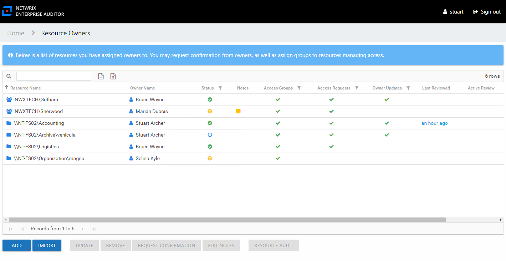
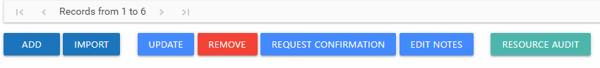

# Resource Owners Interface

The Resource Owners interface opened by the **Resource Owners** button on the Access Information Center Home page is where Ownership Administrators perform many operations around assigning and managing ownership.

The information displayed in the table includes:

* Resource Name – The icon indicates the type of resource. The resource name includes its location, such as the UNC path for a file system resource, the URL for SharePoint resource, or Group name (e.g., [Domain]\[Group]). The hyperlink will open the Resource Audit interface or Group Audit interface directly to the selected resource. See the [Audit Interfaces](../ResourceAudit/Navigate/Overview "Audit Interfaces") topic for additional information on available reports.
* Description – Description or explanation of the resource as supplied by either the Ownership Administrator or the assigned owner See the [Notes & Descriptions](#Notes "Notes & Descriptions") topic for additional information.
* Owner Name – Name of the assigned owner. If there are several owners of a resource, the list is comma-separated.
* Status – Indicates whether or not the assigned owner has confirmed ownership of that resource. Tool-tips display when hovering over the icons indicating whether the resource ownership has been confirmed, declined, pending response, or that a confirmation has not been requested. The tool-tip also displays the date timestamp for when confirmation was received. See the [Ownership Confirmation](Confirmation "Ownership Confirmation") topic for additional information.
* Notes – Icon indicates a Note has been added. Click on the icon to read the attached note(s). Notes can be added by Ownership Administrators or populated with alternative owners by individuals who declined ownership. See the [Edit Notes Window](../../General/EditNotes "Edit Notes Window") and the [Notes & Descriptions](#Notes "Notes & Descriptions") topic for additional information.
* Access Groups – Indicates whether or not access groups have been assigned to this resource. When the resource is a group, the Access Groups column is automatically checked, since the group itself is considered an access group. When File System or SharePoint resources will be managed through the AIC, it is necessary to configure access groups for those resources in the target environment. An access group provides one of the following access levels to a specific resource: Read, Modify, or Full Control. Access groups are required to enable the owner ad hoc changes, to enable the Access Information Center to automatically commit approved changes requested during entitlement reviews, to enable the Self-Service Access Requests workflow, and for publishing resources to IAM. See the [Access Groups](AccessGroups "Access Groups") topic for additional information.
* Access Requests – Indicates whether or not the Self-Service Access Requests workflow has been enabled for the resource. See the [Access Requests Overview](../AccessRequests/Overview "Access Requests Overview") topic for additional information.
* Owner Updates – Indicates whether or not ad hoc changes feature has been enabled for the resource
* Last Reviewed – Date timestamp when the last review took place for the resource. The hyperlink will open the Manage Reviews interface to that resource. See the [Manage Reviews Page](../ResourceReviews/Interface#Manage "Manage Reviews Page") topic for additional information.
* Active Review – Indicates whether or not there is a pending review

The table data grid functions the same way as other table grids. See the [Data Grid Features](../../General/DataGrid "Data Grid Features") topic for additional information.

The buttons at the bottom enable you to conduct the following actions:

| Button | Function |
| --- | --- |
| Add | Launches the Add new resource wizard to add a new resource to the list. This allows you to add one resource at a time, assign a reviewer, and optionally assign access groups. See the [Add New Resource Wizard](Wizard/Add "Add New Resource Wizard") topic for additional information. |
| Import | Opens the Import Owners window to perform a bulk import of resources and assigned owners from a CSV file. See the [Import Owners Wizard](Wizard/Import "Import Owners Wizard") topic for additional information. |
| Update | Launches the Update resource wizard for the selected resource. This allows you to make changes to the assigned owners, to enable Access Requests, to enable owner ad hoc changes, and to change or assign access groups. See the [Update Resource Wizard](Wizard/Update "Update Resource Wizard") topic for additional information. |
| Remove | Opens the Confirm removal window to removes the selected resource from being managed through the application.  *Remember,* only resources with an assigned owner will be visible in the table. Removing a resource from this table does not delete the resource from the application database.  See the [Confirm Removal Window](Window/ConfirmRemoval "Confirm Removal Window") topic for additional information. |
| Request Confirmation | Opens the Confirm Ownership wizard. Sends an email to the assigned owner(s) for the selected resource requesting ownership confirmation. See the [Confirm Ownership Wizard](Wizard/Confirm "Confirm Ownership Wizard") topic for additional information. |
| Edit Notes | Opens the Edit Notes window for the selected resource and allows free-text editing of the notes. See the [Edit Notes Window](../../General/EditNotes "Edit Notes Window") topic for additional information. |
| Resource Audit | Opens the Resource Audit interface for the selected resource. See the [Resource Audit Overview](../ResourceAudit/Overview "Resource Audit Overview") topic for additional information. |

## Notes & Descriptions

A note entered by an Ownership Administrator in the Resource Owners interface is only visible to those with access to this interface. This note can also be populated with alternative owners suggested by an individual who declined ownership.

A note entered by an owner on the fourth page of the Change Resource Access wizard is recorded with the change record and, if selected, included in the notification to the user about their change in access.

A resource description can be supplied by either the Ownership Administrator or the assigned owner, and is visible during Resource Review creation. It is visible to the owner in the Owner portal, and it is to an Access Requester in the Your Access portal.