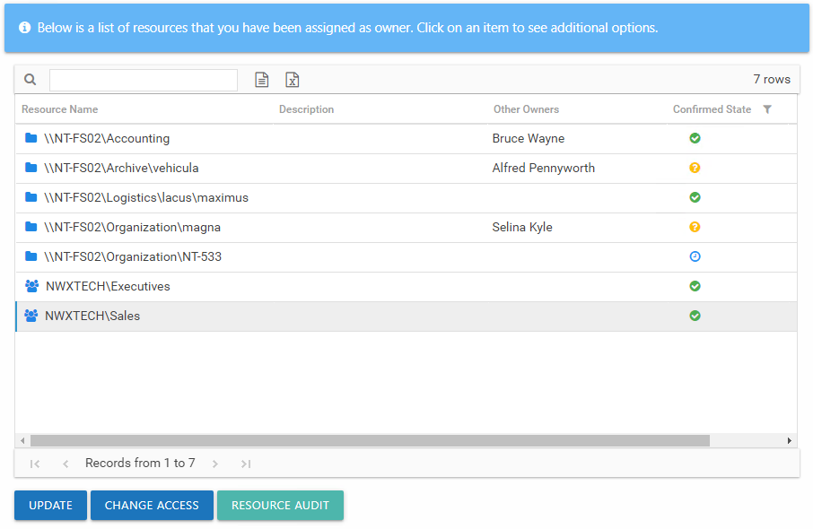
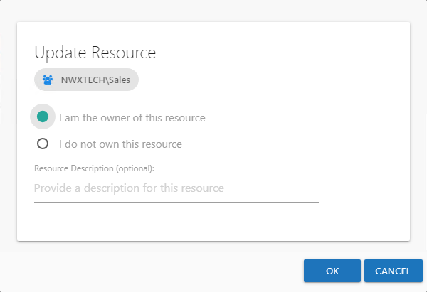

# Assigned Resources

The Assigned Resources section lists all resources assigned to you.

The table contains one row per assigned resource. The information in this table includes:

* Resource Name – The icon indicates the type of resource. The resource name includes its location, such as the UNC path for a file system resource, the URL for SharePoint resource, or Group name (e.g., [Domain]\[Group]).
* Description – Description or explanation of the resource as supplied by either the Ownership Administrator or the assigned owner
* Other Owners – Shows all owners assigned for each resource. The current owner and assigned owners who declined ownership will not show.
* Confirmed State – Indicates whether or not the assigned owner has confirmed ownership of that resource. Tool-tips display when hovering over the icons indicating whether the resource ownership has been confirmed, declined, pending response, or that a confirmation has not been requested. Hover over the icon to display a description of the state and a date timestamp of the last update:

  * Yellow question mark icon – Indicates ownership confirmation has not been requested, and there is no ownership status at this time
  * Blue clock icon – Indicates a request for confirmation has been sent, and you are waiting for a response from the assigned owner.
  * Green check mark icon – Indicates the assigned owner confirmed ownership of the resource.
  * Red X icon – Indicates ownership has been declined, and the resource has not yet been reassigned by the Ownership Administrator. This resource will not be included in the list after the owner leaves the Owner portal or logs out.

The table data grid functions the same way as other table grids. See the [Data Grid Features](../../../General/DataGrid "Data Grid Features") topic for additional information.

The buttons at the bottom enable you to conduct the following actions:

| Button | Function |
| --- | --- |
| Update | Opens the [Update Resource Window](#Update "Update Resource Window") for the selected resource, which allows you to confirm or decline ownership of the resource and to add a description. |
| Change Access | Opens the [Change Resource Access Wizard](ChangeAccess "Change Resource Access Wizard") for the selected resource, which allows you to make ad hoc changes to access and group membership. This button is only enabled if the feature was enabled for the selected resource by the Ownership Administrators. |
| Resource Audit | Opens the Resource Audit interface or Group Audit interface directly to the selected resource. See the [Audit Interfaces](../../ResourceAudit/Navigate/Overview "Audit Interfaces") topic for additional information. |

## Update Resource Window

The **Update** button on the Owner portal opens the Update Resource window for the selected resource. You can confirm ownership, decline ownership, and optionally enter a description for the resource.

There are two options for ownership confirmation:

* I am the owner of this resource — Select this radio button to confirm ownership of the resource. The Resource Description field enables you to optionally provide a description for this resource. This description will be visible to domain users requesting access as well as Ownership Administrators, Resource Review Administrators, and Self-Service Access Request Administrators.
* I do not own this resource — Select this radio button to deny ownership of the resource. The Do you know who the owner is? field enables you to enter the name of an individual who might be the owner.

Click **OK** to save any changes or Cancel to close the window without saving changes.