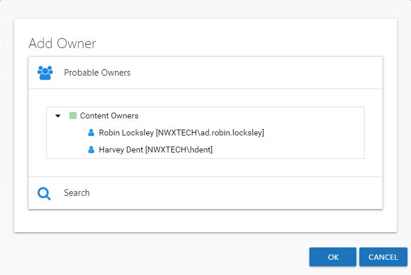
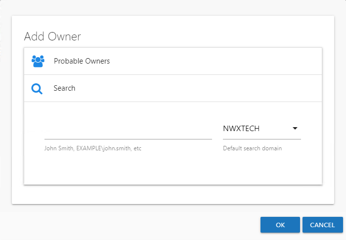

# Add Owner Window

The Add Owner window opens from either the [Add New Resource Wizard](../Wizard/Add "Add New Resource Wizard") or the [Update Resource Wizard](../Wizard/Update "Update Resource Wizard"). Choose between:

* [Select a Probable Owner](#Select "Select a Probable Owner") — Select from a calculated list of probable owners
* [Search for Owner](#Search "Search for Owner") — Browsing Active Directory for a user account

## Select a Probable Owner

Probable owners are calculated from the available data:

* For File System and SharePoint resources

  * Common Managers – Calculated by looking at the users who have created content within the resource and their manager as defined in Active Directory
  * Content Owners – Calculated by looking at the users who have created content within the resource
  * Active Users – Calculated by looking at the users who have performed activity within the resource as identified by Access Analyzer activity audits
* For groups

  * Administrators – Calculated by looking at the Managed By property for the selected group
  * Common Managers – Calculated by looking at the Manager property for the users within the selected group

**NOTE:** The Probable Owner categories may or may not be populated with options. For File System or SharePoint resources, it depends on content and activity data which has been collected by Access Analyzer. If no content or activity information exists, no owner will be recommended. For Active Directory resources, it depends on the Managed By property for groups and the Manager property for users to be set within Active Directory. If these properties are blank, no owner will be recommended.

Select the desired owner from the list and click **OK**. The Add Owner window closes and the selected user appears in the Owner list.

## Search for Owner

Enter a name in the search field to find and select users from Active Directory, which populates in a drop-down menu as you type. If multiple domains are known to the application, ensure the correct domain is selected from the drop-down menu. Click **OK** and the Add Owner window closes. The selected user appears in the Owner list.