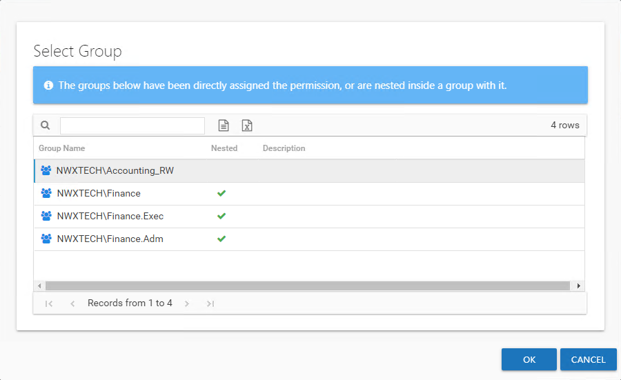

# Select Group Window

The Select Group window opens from either the [Add New Resource Wizard](../Wizard/Add "Add New Resource Wizard") or the [Update Resource Wizard](../Wizard/Update "Update Resource Wizard").

The window displays groups with the selected access level for this resource. If there are no groups displayed, then it will be necessary to create a group and grant it this level of access to the selected resource. Do not forget to run the Access Analyzer collection jobs to introduce the new group to the Access Information Center. Select the desired group and click **OK**. The Select Group window closes and the group appears in the table for the wizard.