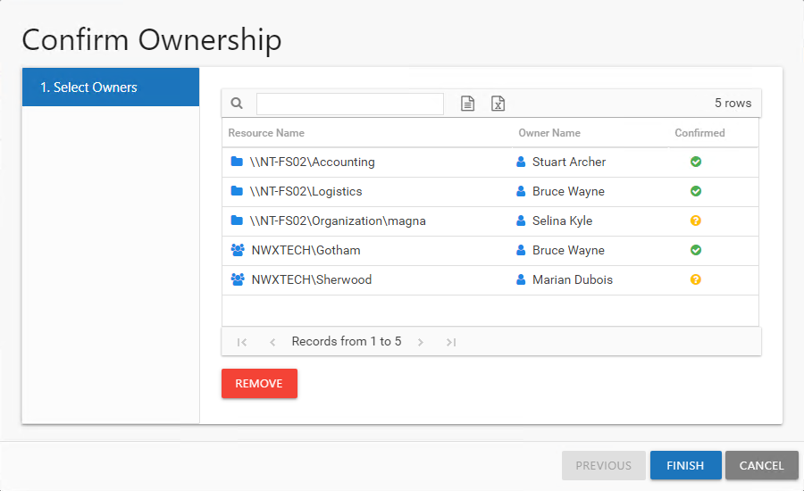
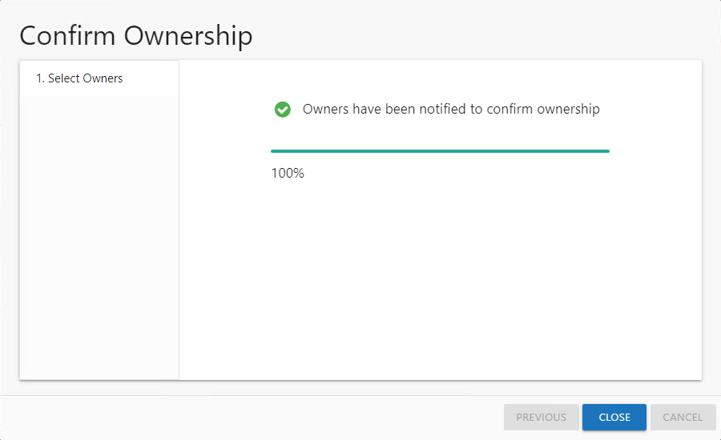

# Confirm Ownership Wizard

The Confirm Ownership wizard is opened with the **Request Confirmation** button in the Resource Owners interface. It can be opened for one or multiple resources.

It contains one page:

* 1. Select Owners — Lists the current owner(s) for each selected resource and confirmation status

See the [Request Ownership Confirmation](#Request "Request Ownership Confirmation") topic for additional information.

## Request Ownership Confirmation

Follow the steps to request ownership confirmation.

**Step 1 –** In the Resource Owners interface, select the desired resource or resources and click Request Confirmation. The Confirm Ownership wizard opens.

**Step 2 –** On the Select Owners page, you can optionally remove owners you do not want or need ownership confirmation from. Select those owners and click **Remove**. Those owners will not receive the confirmation email. Once the list is set as desired, click **Finish**. The Access Information Center begins to send the confirmation email. The table provides the following information:

* Resource Name — The icon indicates the type of resource. The resource name includes its location, such as the UNC path for a file system resource, the URL for SharePoint resource, or Group name (e.g., [Domain]\[Group]).
* Owner Name — Name of the assigned owner
* Confirmed — Indicates whether or not the assigned owner has confirmed ownership of that resource. Tool-tips display when hovering over the icons indicating whether the resource ownership has been confirmed, declined, pending response, or that a confirmation has not been requested.

**Step 3 –** The action status displays on the page. When the owner confirmation notification has completed (100%), click Close. The Confirm Ownership wizard closes.

The selected owners receive an email from the Access Information Center asking if they are the owner of the assigned resource. See the [Owner Confirmation Request Email](../Email/ConfirmationRequest "Owner Confirmation Request Email") topic for additional information.