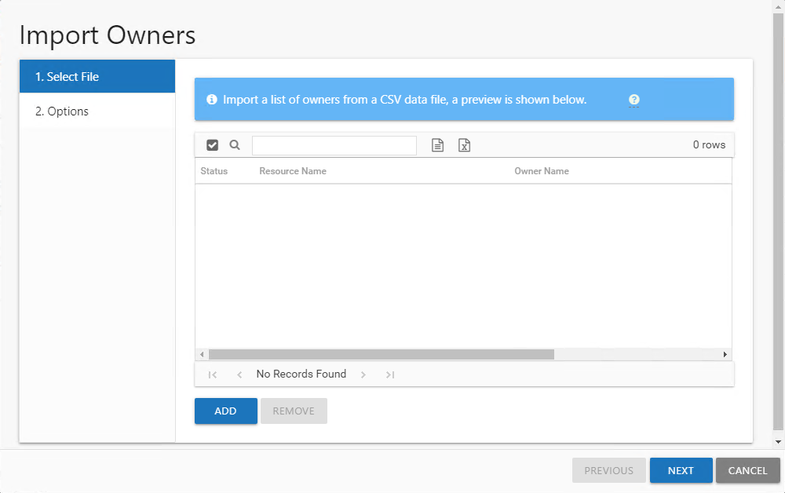
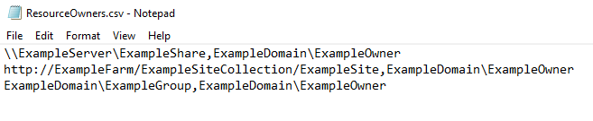
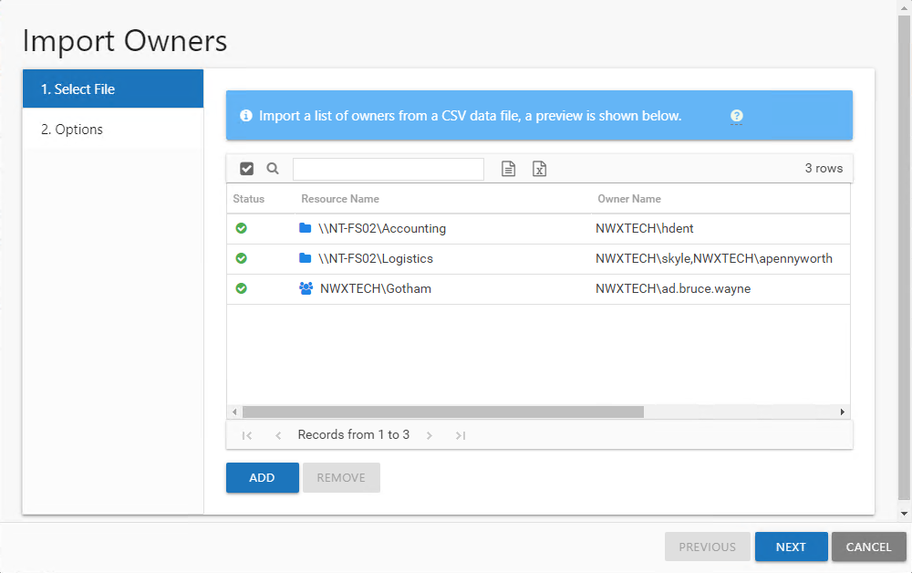
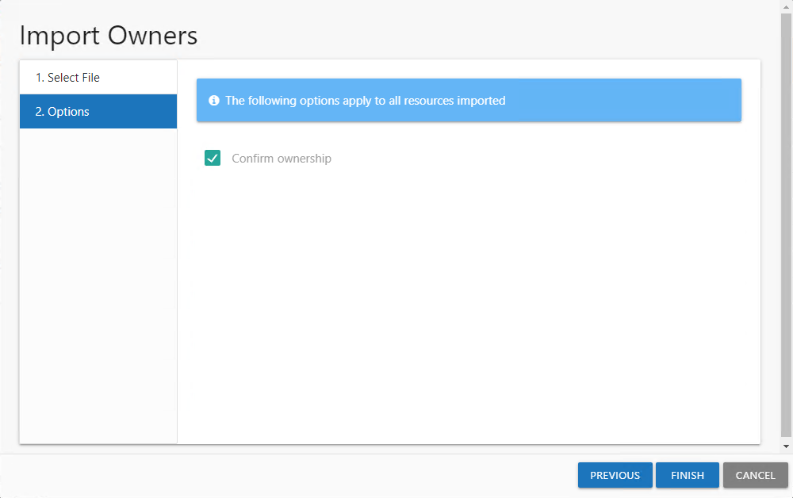
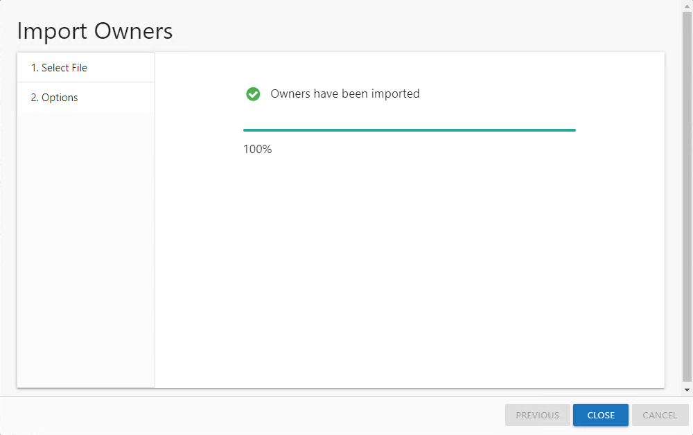

# Import Owners Wizard

The Import Owners wizard is opened with the **Import** button in the Resource Owners interface.

It contains two pages:

* 1. Select File — Select the CSV file with the resource or group to be managed through the Access Information Center and the assigned owner. A preview of the selected file displays on this page.
* 2. Options — Provides the option for marking all imported resources as having confirmed ownership. If the CSV file only contains Groups, you can additionally select to enable Access Requests and Owner Ad Hoc changes for them.

The CSV file should list one resource per row using the following format:

[ResourcePath],[Owner1];[Owner2];[Owner3],[Description]

* Resource Formats:

  * File System Resources – Resource path should be the UNC path to the share or folder.

    \\ExampleServer\ExampleShare,ExampleDomain\ExampleOwner
  * SharePoint Resources – Resource path should be the URL to the site resource.

    http://ExampleFarm/ExampleSiteCollection/ExampleSite,ExampleDomain\ExampleOwner
  * Groups – Resource path should be the NTAccount [DOMAIN\NAME] for the group or distribution list

    ExampleDomain\ExampleGroup,ExampleDomain\ExampleOwner
* Multiple owners can be added, separated by a semicolon (;)

  ExampleDomain\ExampleGroup,ExampleDomain\ExampleOwner1;ExampleDomain\ExampleOwner2
* *(Optional)* A description for the resource can be added after the last owner

  ExampleDomain\ExampleGroup,ExampleDomain\ExampleOwner1;ExampleDomain\ExampleOwner2,Security group for access to the Example share

*Remember,* if the CSV file contains resources other than just Groups, this method only imports resources with owners. It will be necessary to update each resource to enable Access Requests and Owner Ad Hoc changes. See the [Update Resource Wizard](Update "Update Resource Wizard") topic for additional information.

See the [Import Owners](#Import "Import Owners") topic for additional information.

## Import Owners

Follow the steps to import a list of multiple resources with assign owners into the Owners interface.

**Step 1 –** In the Resource Owners interface, click **Import**. The Import Owners wizard opens.

**Step 2 –** On the Select Files page, click **Add**.Navigate to the CSV file to be imported and click **Open**.

**Step 3 –** A preview of the resources and owners appears in the table. The Status column indicates whether or not there is a problem (invalid resource or owner). Ensure all resources in the table have a green tick icon in the Status column, and click **Next** to continue with the import.

**NOTE:** If a problem is indicated, additional information is displayed by hovering over the red exclamation icon. You can not continue with the import if any row contains an invalid resource or owner. To remove a resource from the table, select the row and click **Remove**. The row is removed from the table.

**Step 4 –** On the Options page, configure the available options as required.

* Confirm ownership — This will automatically confirm ownership for all of the resources upon import, and is selected by default. If ownership confirmation is not required for these resources, deselect the Confirm ownership for imported resources checkbox.
* If the CSV file only contains Groups and no other resource types, the following additional options are available:

  * Allow access requests — Enable/Disable your domain users to make self-service access requests for this Group
  * Allow owners to change access — Enable/Disable the owner to make Ad Hoc access changes for this Group

**Step 5 –** Click **Next**. The Access Information Center will begin to process the import.

**Step 6 –** The action status displays on the page. When the update has completed (100%), click **Close**. The Import Owners wizard closes.

These resources are now being manages by the Access Information Center. See the [Update Resource Wizard](Update "Update Resource Wizard") topic for information on making alterations to the imported resources.