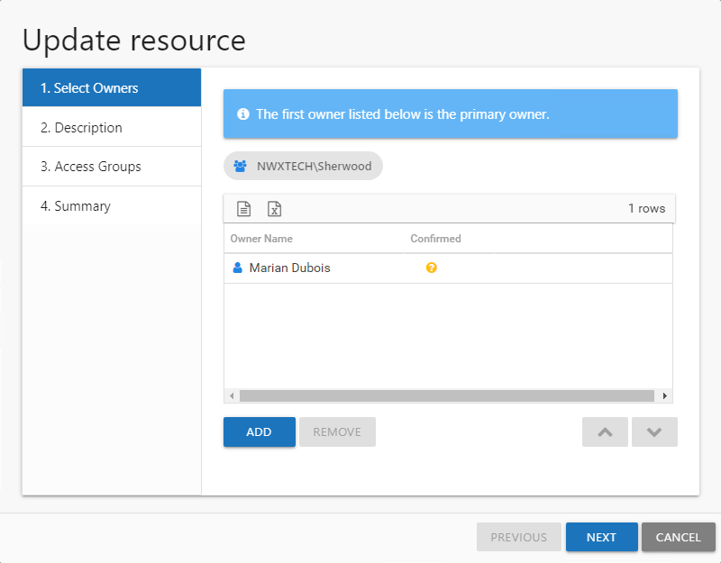
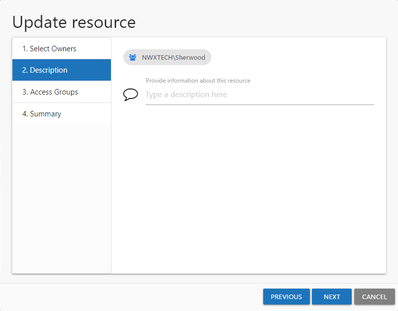
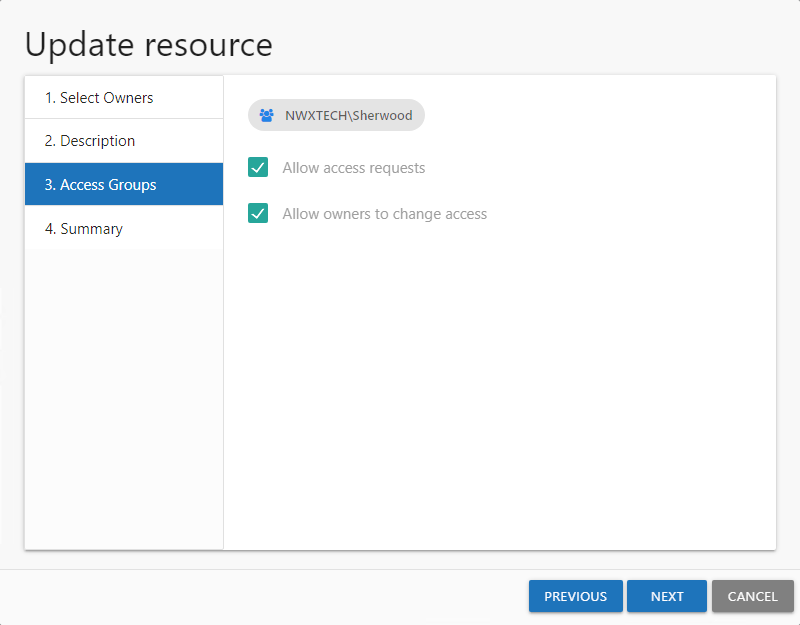
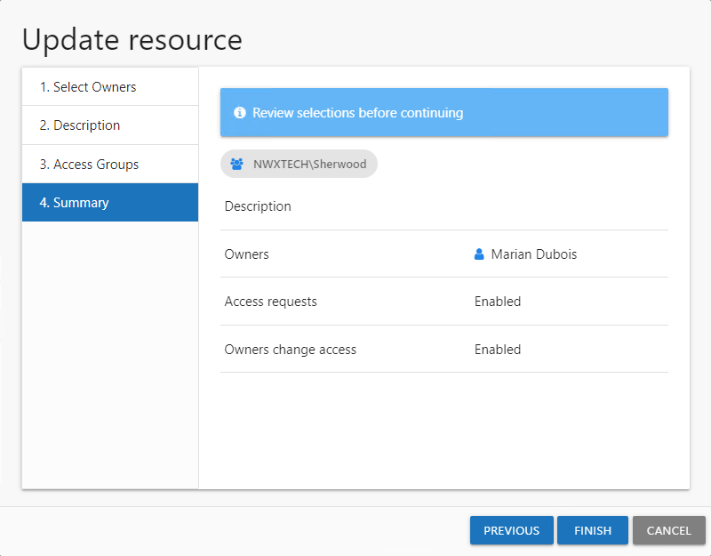
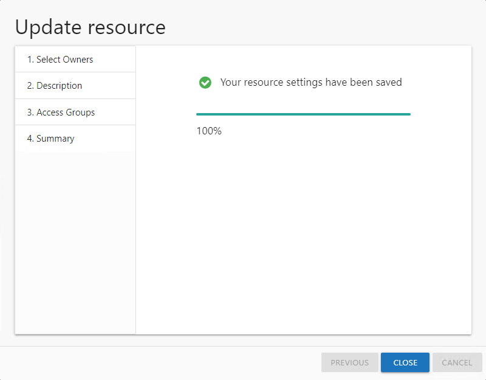

# Update Resource Wizard

The Update resource wizard is opened with the **Update** button in the Resource Owners interface.

It contains four pages:

* 1. Select Owners — Lists the current owner(s). Modify by adding new owners, removing owners, or changing owner priority order (primary, secondary, etc.)
* 2. Description — Enter or modify a note describing the resource
* 3. Access Groups — Enable or disable Access Requests and Owner Ad Hoc changes for this resource. When File System or SharePoint resources will be managed through the AIC, it is necessary to configure access groups for those resources in the target environment. An access group provides one of the following access levels to a specific resource: Read, Modify, or Full Control.

  **NOTE:** This feature requires the Access Information Center is to be configured to commit changes in Active Directory. Additionally, resource based groups must be set up on the resource. See the [Commit Active Directory Changes](../../Admin/AdditionalConfig/CommitChanges "Commit Active Directory Changes") topic for additional information.
* 4. Summary — Provides a preview of the settings selected within the wizard

See the [Update a Resource](#Update "Update a Resource") topic for additional information.

## Update a Resource

Follow the steps to update ownership configuration for a resource.

**Step 1 –** In the Resource Owners interface, select the desired resource and click **Update**. The Update resource wizard opens.

**Step 2 –** The Select Owners page lists the currently assigned owner(s). Modify as desired and click **Next** to continue.

* Add new owners — Click **Add** to browse for a new owner. See the [Add Owner Window](../Window/AddOwner "Add Owner Window") topic for additional information.
* Remove an owner — Select an owner and click **Remove**
* Change owner priority — Select an owner and use the arrow buttons to change the order

*Remember,* the first owner in the list is the primary owner. The table has several columns with information on the owners:

* Owner Name — Name of the assigned owner
* Owner Account — sAMAccountName associated with the owner, as read from Active Directory
* Owner Title — Trustee's title as read from Active Directory
* Owner Mail — Trustee's email address as read from Active Directory
* Owner Department — Trustee's department as read from Active Directory
* Confirmed — Indicates whether or not the assigned owner has confirmed ownership of that resource. Tool-tips display when hovering over the icons indicating whether the resource ownership has been confirmed, declined, pending response, or that a confirmation has not been requested.

**Step 3 –** The Description page displays any description that has been provided by either the Ownership Administrator or the assigned owner(s) for the resource. Modify as desired by typing in the textbox. Then click **Next** to continue.

**Step 4 –** The Access Groups page indicates whether or not the resource is available for Access Requests or Owner Ad Hoc changes. Modify as desired and click **Next** to continue.

* Allow access requests — Enable/Disable your domain users to make self-service access requests for this resource
* Allow owners to change access — Enable/Disable the owner to make ad hoc access changes for this resource

**NOTE:** File System and SharePoint resources must have resource based groups configured for each level of access: Read, Modify, and Full Control. If either option is selected for this resource, it is necessary to set a group for at least one access level. Select the desired access level and click **Change**. The Select Group Window opens. Select the desired group and click **OK**. The Select Group window closes and the group appears in the table. Repeat this step for each access level desired. See the [Select Group Window](../Window/SelectGroup "Select Group Window") topic for additional information.

**Step 5 –** On the Summary page, review the settings and click **Next**. The Access Information Center begins to process the ownership configuration.

**Step 6 –** The action status displays on the page. When the update has completed (100%), click **Close**. The Update resource wizard closes.

This updates to ownership configuration have been processed.