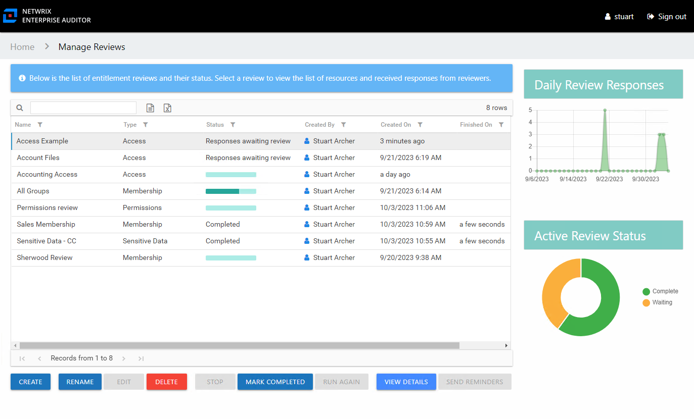
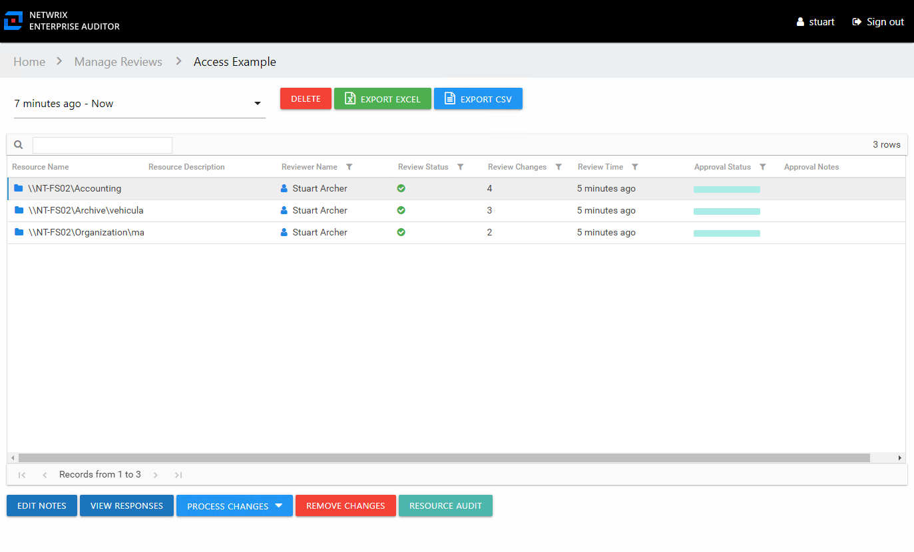

# Approval Process

After all owners assigned to a specific review have submitted their review, its status on the Manage Reviews page of the Resource Reviews interface changes to Responses awaiting review.

In the approval process, the Review Administrator looks at the owner-recommended changes and chooses to approve, deny, or defer the changes.

The Review Administrator may choose to model the requested changes to see how the user's overall access will be impacted. Change modeling is conducted through the Resource Audit interface. You can access this interface via the **Resource Audit** button on the [Review Details Page](Interface#Review's "Review Details Page"). See the [Model Changes in the AIC](../ResourceAudit/ChangeModeling/Model "Model Changes in the AIC") topic for additional information.

**CAUTION:**  If the Access Information Center has been configured to commit changes to Active Directory and the automation prerequisites have been met for this type of review, this change will be committed when the review is complete.

If the Access Information Center automatically commits the approved change, it is immediately visible in Access Information Center reports. It is not necessary to rescan with Netwrix Access Analyzer (formerly Enterprise Auditor). If approved changes are being manually committed by your organization's IT team, it will be necessary to rescan the environment before the changes will be reflected in Access Information Center reports.

See the [Process Owner Responses](#Process "Process Owner Responses") topic for instructions on how to perform a granular review of owner-recommended changes. See the [Batch Processing](#Batch "Batch Processing") topic for instructions on how to approve, decline, or defer all owner-recommended changes for a review.

## Process Owner Responses

Follow the steps to perform a granular review of a resource owner's recommended changes.

**CAUTION:**  If the Access Information Center has been configured to commit changes to Active Directory and the automation prerequisites have been met for this type of review, this change will be committed when the review is complete.

**Step 1 –** On the Manage Reviews page, select a review and click **View Details**. The Review Details page opens.

**Step 2 –** Select a resource in the list and click **View Responses**. The View Responses window opens.

*Remember,* the **Resource Audit** button opens the Resource Audit interface filtered to that resource's reports. This is where you can conduct change modeling.

**Step 3 –** By default, the table displays only the recommended changes. Select an item and click the desired action button: Accept, Decline, or Defer. The Approval column icon updates. See the [View Responses Window](Window/ViewResponses "View Responses Window") topic for additional information.

**Step 4 –** Repeat Step 3 until all changes have been processed. Then click **Close**. The View Responses window closes.

**Step 5 –** Repeat Steps 2-4 for each resource included in the review.

**Step 6 –** Remediation of the accepted changes can be done one of two ways:

* Automatic — If the Access Information Center has been configured to commit AD changes, accepted changes were implemented if the prerequisites were met. If this was a Sensitive Data review, you may need to export the approved changes and send those to your IT department. See the [Automation Prerequisites](Prerequisites#Automati "Automation Prerequisites") topic for additional information.
* Manual — Accepted changes must be implemented outside of the application by your IT department. Use the **Export Excel** or **Export CSV** buttons to generate and download an export of accepted changes.

**Step 7 –** When remediation is complete, return to the Mange Reviews page (click on the breadcrumb). Select the review in the list and click **Mark Completed**.

The review remains marked as Completed until the next instance is started.

## Batch Processing

Follow the steps to perform a batch processing of a resource owner's recommended changes.

**CAUTION:**  If the Access Information Center has been configured to commit changes to Active Directory and the automation prerequisites have been met for this type of review, this change will be committed when the review is complete.

**Step 1 –** On the Manage Reviews page, select a review and click **View Details**. The Review Details page opens.

**Step 2 –** Select a resource in the list and open the **Process Changes** drop-down menu. You can also select multiple resources in the list to be processed at once using the **Ctrl** and **Shift** key and click combinations.

*Remember,* the **Resource Audit** button opens the Resource Audit interface filtered to that resource's reports. This is where you can conduct change modeling.

**Step 3 –** Select the desired action for all recommended changes: Accept, Decline, or Defer.

*Remember,* all recommended changes for the selected resource will be processed with the same resolution.

**Step 4 –** Repeat Steps 2-3 for each resource included in the review.

**Step 5 –** Remediation of the accepted changes can be done one of two ways:

* Automatic — If the Access Information Center has been configured to commit AD changes, accepted changes were implemented if the prerequisites were met. If this was a Sensitive Data review, you may need to export the approved changes and send those to your IT department. See the [Automation Prerequisites](Prerequisites#Automati "Automation Prerequisites") topic for additional information.
* Manual — Accepted changes must be implemented outside of the application by your IT department. Use the **Export Excel** or **Export CSV** buttons to generate and download an export of accepted changes.

**Step 6 –** When remediation is complete, return to the Mange Reviews page (click on the breadcrumb). Select the review in the list and click **Mark Completed**.

The review remains marked as Completed until the next instance is started.