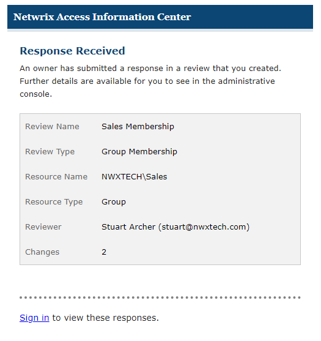

# Resource Reviewed Email

If the **Notify review creator when resources are reviewed** option is selected for a review, the review creator receives an email notification when the resource owner submits their response for each resource included in the review.

This option can be selected by an Administrator or Security Team user when creating a new review with the Create Review Wizard, or when creating a new review instance using the Run Again option. You can also select the option for a pending review using the Edit Review wizard. See the [Create Review Wizard](../Wizard/Create "Create Review Wizard") and [Edit Review Wizard](../Wizard/Edit "Edit Review Wizard") topics for additional information.

The email includes information about the review and the number of changes that have been submitted by the resource owner. Sign in to see the response and process the review. See the [Approval Process](../ApprovalProcess "Approval Process") topic for additional information.