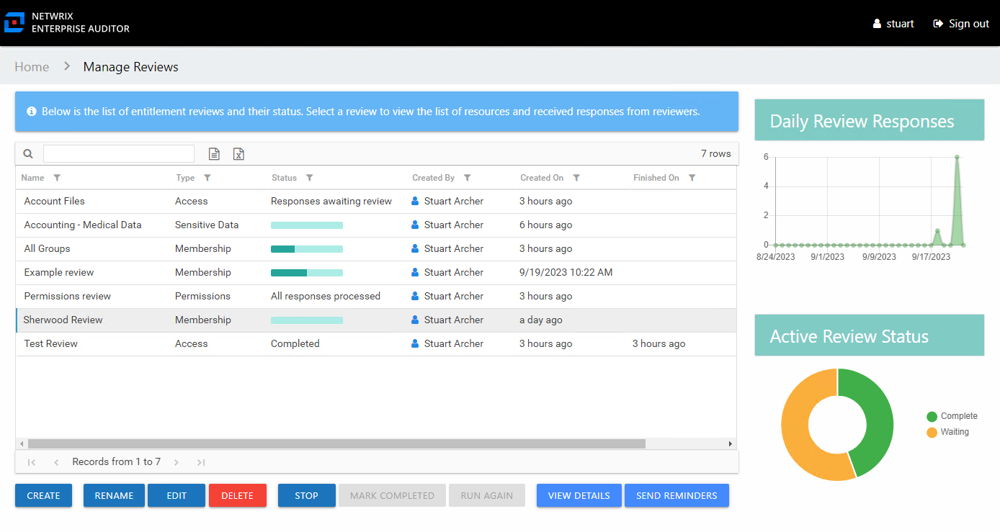
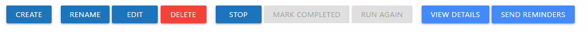
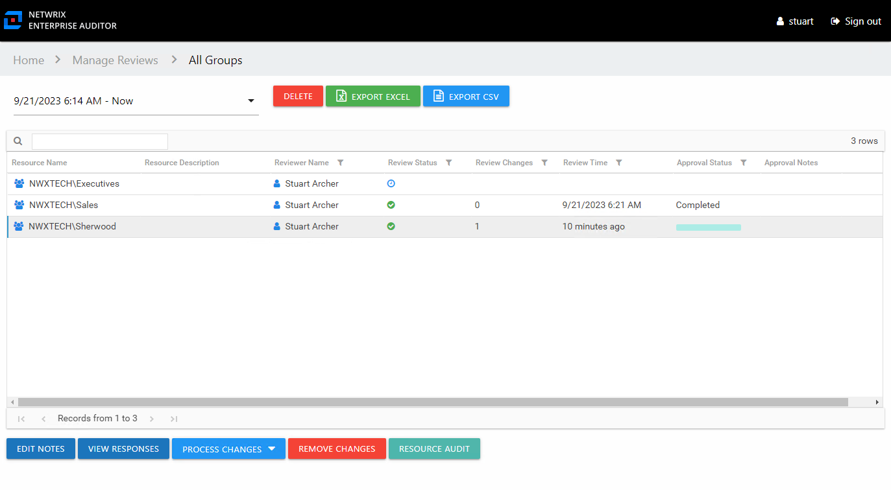
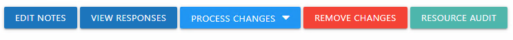

# Resource Reviews Interface

The Resource Reviews interface opened by the **Resource Reviews** button on the Access Information Center Home page is where Review Administrators perform many operations around managing reviews. This interface has multiple pages:

* [Manage Reviews Page](#Manage "Manage Reviews Page") — Create and manage all reviews
* [Review Details Page](#Review's "Review Details Page") — Manage and view all instances for a specific review

## Manage Reviews Page

The Manage Reviews page is the first page in the Resource Reviews interface. It displays high-level information for reviews.

The interface includes:

* Table of reviews
* Daily Review Responses line graph
* Active Review Status donut graph

The information displayed in the table includes:

* Name — Name of the review, as provided by the Review Administrator.
* Type — Type of review:

  * Access – Review user access rights to resources
  * Membership – Review group membership
  * Permissions – Review trustee permissions to resources
  * Sensitive Data – Review files containing potentially sensitive data stored within resources
* Status — Status of the review:

  * Status bar with specified percentage completed

    * [Empty bar] 0% – Indicates not started. Hovering over the bar will display the number of items included.
    * [Partially filled bar] with a non-zero% – Indicates the specific percentage of items completed. Hovering over the bar displays the number of items completed out of the total number of items.
  * Responses awaiting review — Owner(s) completed reviews. Waiting on Review Administrator's approval.
  * Stopped — Indicates that the review was stopped and is considered complete even if all of the responses have not been received or processed. The review remains static until it is run again.
  * All responses processed — Reviews have been approved by Review Administrators. The review can be marked as completed.
  * Completed — Indicates the Review Administrator has processed the owners' responses. The review remains static until it is run again. This status can appear by accepting the review as-is with the **Mark Completed** button.
* Created By — Name of the Review Administrator who create the review
* Created On — Date timestamp for when the review was creation. If it has been run multiple times, this is the date timestamp of the last instance.
* Finished On — Date timestamp when the review is marked complete by the Review Administrator. If it has been run multiple times, this is the date timestamp of the last instance.

The table data grid functions the same way as other table grids. See the [Data Grid Features](../../General/DataGrid "Data Grid Features") topic for additional information.

The buttons at the bottom enable you to conduct the following actions:

| Button | Description |
| --- | --- |
| Create | Launches the Create Review wizard for creating a new review. See the [Create Review Wizard](Wizard/Create "Create Review Wizard") topic for additional information. |
| Rename | Opens the Rename Review window for modifying the review name. See the [Rename Review Window](Window/RenameReview "Rename Review Window") topic for additional information. |
| Edit | Opens the Edit Review wizard for the selected review. This allows you to edit some options for an in progress review. See the [Edit Review Wizard](Wizard/Edit "Edit Review Wizard") for additional information. |
| Delete | Opens the Delete Review window to delete review and its instance history, which asks for confirmation of the action. See the [Delete Review Window](Window/DeleteReview "Delete Review Window") topic for additional information. |
| Stop | Opens the Stop Review window, which asks for confirmation of the action. See the [Stop Review Window](Window/StopReview "Stop Review Window") topic for additional information. |
| Mark Completed | Closes the selected review as-is and marks it as completed. Requires the owner(s) to have responded.  **CAUTION:** No confirmation is requested for this action. |
| Run Again | Opens the Create Review wizard for the selected review without the option to change the review type. Modify as desired and relaunch the review. See the [Review Instances](ReviewInstances "Review Instances") topic for additional information. |
| View Details | Opens the Review Details page for the selected review. See the [Review Details Page](#Review's "Review Details Page") topic for additional information. |
| Send Reminders | Sends a notification email to the assigned owner(s), reminding of the pending review. Opens the Send Reminders window, which indicates an action status. See the [Send Reminders Window](Window/SendReminders "Send Reminders Window") topic for additional information. |

## Review Details Page

The Review Details page displays information for all instances of the selected review, which is named in the page breadcrumb. This page is opened by selecting a review and clicking **View Details**.

Instances are selected from the drop-down menu. By default the most current instance will be displayed. Instances are named with date timestamps indicating the start and end times for the review instance.

The information displayed in the table includes:

* Resource Name — The icon indicates the type of resource. The resource name includes its location, such as the UNC path for a file system resource, the URL for SharePoint resource, or Group name (e.g., [Domain]\[Group]).
* Resource Description — Description or explanation of the resource as supplied by either the Ownership Administrator or the assigned owner
* Reviewer Name — Primary owner assigned to the resource
* Review Status — Indicates whether or not the assigned owner has submitted the review. Tool-tips display when hovering over the icons.
* Review Changes — Displays a count of items that have recommended changes for the resource
* Review Time — Date timestamp for when the owner submitted the review
* Approval Status — Status of the Review Administrator's approval:

  * Blank — Indicates the owner has not completed the review for the resource
  * Status bar with specified percentage completed

    * [Empty bar] 0% – Indicates not started. Hovering over the bar will display the number of items included.
    * [Partially filled bar] with a non-zero% – Indicates the specific percentage of items completed. Hovering over the bar displays the number of items completed out of the total number of items.
  * Completed — Indicates the Review Administrator has processed the owners' responses. The review remains static until it is run again.
* Approval Notes – Icon indicates a Note has been added. Click on the icon to read the attached note(s). Notes displayed here can only be added or viewed by the Review Administrator. See the [Edit Notes Window](../../General/EditNotes "Edit Notes Window") topic for additional information.

The table data grid functions the same way as other table grids. See the [Data Grid Features](../../General/DataGrid "Data Grid Features") topic for additional information.

The buttons at the top and bottom enable you to conduct the following actions:

| Button | Description |
| --- | --- |
| Delete | Opens the Delete Review window to delete selected review instance, which asks for confirmation of the action. See the [Delete Review Window](Window/DeleteReview "Delete Review Window") topic for additional information. |
| Export Excel | Exports the selected review instance information to an Excel spreadsheet. This automatically downloads the spreadsheet. See the [Data Grid Features](../../General/DataGrid "Data Grid Features") topic for additional information. |
| Export CSV | Exports the selected review instance information to a CSV file. This automatically downloads the file. See the [Data Grid Features](../../General/DataGrid "Data Grid Features") topic for additional information. |
| Edit Notes | Opens the Edit Notes window for the selected resource and allows free-text editing of the notes. See the [Edit Notes Window](../../General/EditNotes "Edit Notes Window") topic for additional information. |
| View Responses | Opens the View Responses window, which is only available if the owner has recommended changes for the resource. This window displays all recommended changes, notes provided by the owner for the recommended change, and action buttons to Accept, Decline, or Defer the recommended change. See the [View Responses Window](Window/ViewResponses "View Responses Window") topic for additional information. |
| Process Changes | Opens a drop-down menu to Accept, Decline, or Defer all owner-recommended changes for the selected resource. This option allows the Review Administrator to process responses in batches, so all owner-recommended changes for the selected resource will be processed with the same action.  **CAUTION:** If the Access Information Center has been configured to commit changes to Active Directory and the automation prerequisites have been met for this type of review, selecting Accept will commit the requested changes. |
| Remove Changes | Opens the Remove changes window. Clears all requested changes for the selected resource. The resource is returned to a ‘Waiting’ status, requiring the owner to review the resource again. See the [Remove Changes Window](../../General/RemoveChanges "Remove Changes Window") topic for additional information. |
| Resource Audit | Opens the Resource Audit interface for the selected resource. See the [Resource Audit Overview](../ResourceAudit/Overview "Resource Audit Overview") topic for additional information. |