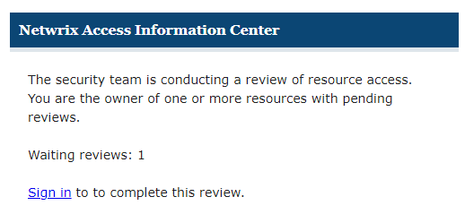
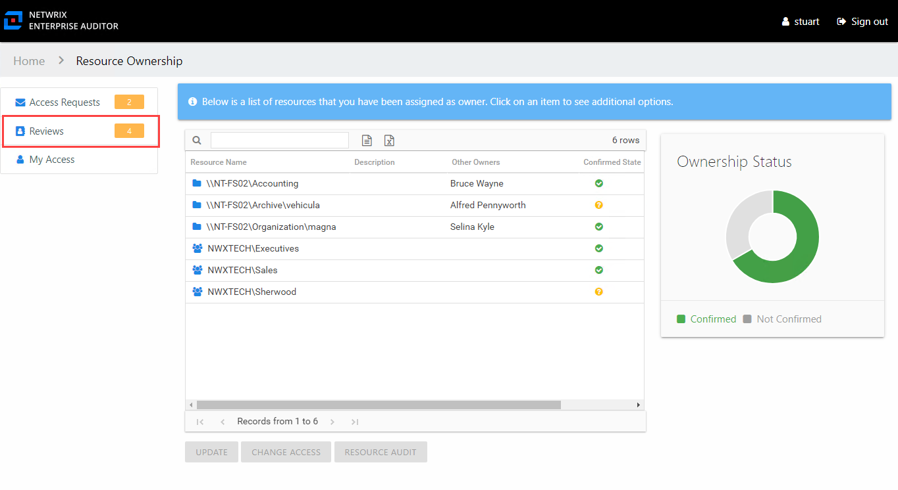
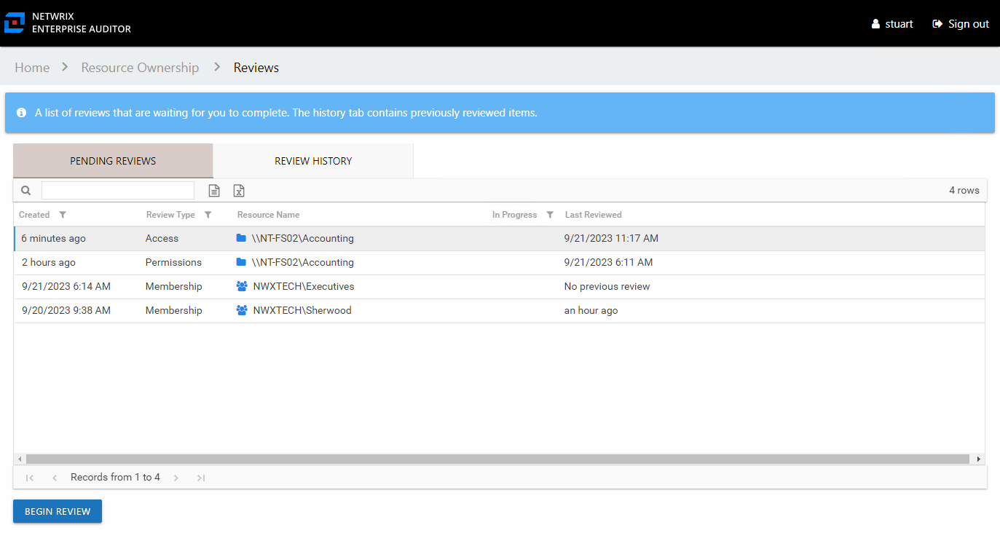
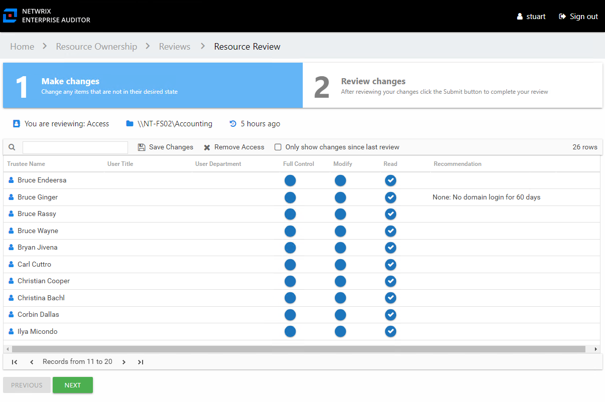

# Owners & Resource Reviews

When your organization performs a resource review on a resource for which you are the assigned owner, it means you, the business user or data custodian, need to attest to the access and privileges users have to your resource. When the Review Administrator creates a new review or starts a new instance of an existing review, you receive an email notification that includes a link to the your pending reviews.

Use the **Sign in** link at the bottom to open the Owner portal in the Access Information Center.

*Remember,* Your company domain credentials are used to log in.

The Owner portal displays a number next to the **Reviews**link to indicate how many of your resources are included in pending reviews. Click the link to open the Reviews interface. The Reviews interface has two pages: Pending Reviews and Review History. See the [Pending Reviews Page](#Pending "Pending Reviews Page") and [Review History Page](ReviewHistory "Review History Page") topics for additional information.

## Pending Reviews Page

The Pending Reviews page lists all of your resources included in pending reviews.

The information displayed in the table includes:

* Created — Date timestamp for when the review was creation. If it has been run multiple times, this is the date timestamp of the last instance.
* Review Type – Type of review:
  * Access – Review user access rights to resources
  * Membership – Review group membership
  * Permissions – Review trustee permissions to resources
  * Sensitive Data – Review files containing potentially sensitive data stored within resources
* Resource Name — The icon indicates the type of resource. The resource name includes its location, such as the UNC path for a file system resource, the URL for SharePoint resource, or Group name (e.g., [Domain]\[Group]).
* Resource Description — Description or explanation of the resource as supplied by either the Ownership Administrator or the assigned owner
* In Progress — Displays a clock icon for an in-progress review
* Last Reviewed — Date timestamp when the last review took place for the resource.

The table data grid functions the same way as other table grids. See the [Data Grid Features](../../General/DataGrid "Data Grid Features") topic for additional information.

Performing a review means you are evaluating the resources. You can leave the resource unchanged or make recommendations for changes. Consider the following examples:

* In an Access or a Permissions review, you can recommend changes to the type of access granted to the resource.
* In a Membership Review, you can recommend removing group membership from specific users.
* In a Sensitive Data review, you can choose between keeping the file as is, recommend that a file be removed from its current location, or indicate that the file is not sensitive and flag it as a false positive.

*Remember,*  any proposed changes are not committed until the Review Administrator approves the recommendation and processes those changes.

## Resource Review Page

The **Begin Review** button opens the Resource Review page to start the review.

The Resource Review page varies based on the type of review; however, there are several common features:

* Tabs — This page has two tabs:

  * 1 Make changes — Displays current access for the resource. For a Sensitive Data review, this tab displays a list of files on your resource where potentially sensitive content has been identified.
  * 2 Review changes — Displays changes you recommend making for your review prior to submission
* You are reviewing — Indicates the type of review, the resource being reviewed, and the date timestamp for when the review instance was started
* Search — Filters the table for matches to the typed value
* Save Changes — Saves all recommended changes, enabling you to leave the review in progress and return at a later time to complete it. It opens the Saving review window, which displays a status for the action.
* Remove Access — On the 1 Make changes tab, removes access from the selected trustee(s). Ctrl-click can be used for multi-select. Current access blue icon with a checkmark will turn to an empty yellow icon.
* Only show changes since last review — Scopes the table to only display those items that have been modified since the last review instance
* Previous / Next buttons — Moves between the two tabs
* Submit button — On the 2 Review changes tab, the **Next** button becomes a **Submit** button. This submits your review to the Review Administrator.

The content within the table varies, and additional options may appear depending on the type of review being conducted. See the following sections for step by step instructions:

* [Perform an Access Review](Review/Access "Perform an Access Review")
* [Perform a Membership Review](Review/Membership "Perform a Membership Review")
* [Perform a Permissions Review](Review/Permissions "Perform a Permissions Review")
* [Perform a Sensitive Data Review](Review/SensitiveData "Perform a Sensitive Data Review")