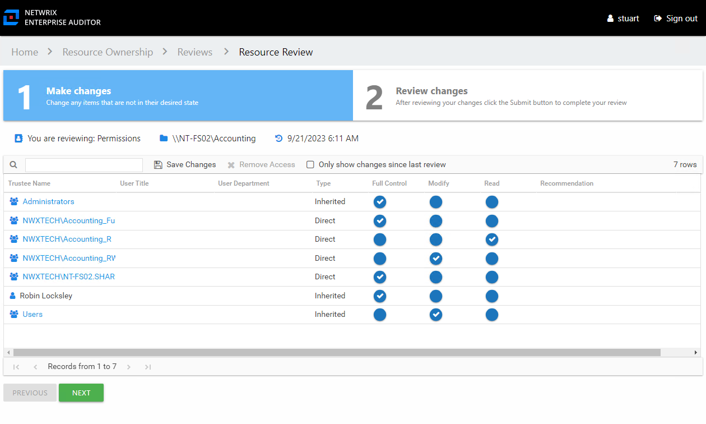
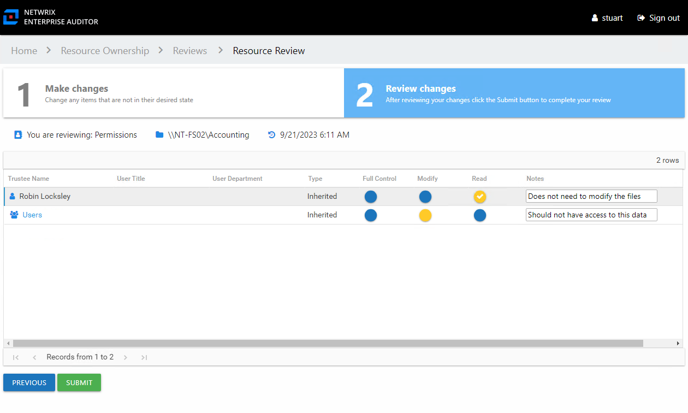

# Perform a Permissions Review

A Permissions review can be conducted for various types of data repository resources. Follow the steps to perform a Permissions review.

**Step 1 –** On the Pending Reviews page, select the resource with a pending Permissions review and click **Begin Review**. The Resource Review page opens to the 1 Make Changes tab.

The table displays permission information for the resource being reviewed:

* Trustee Name — Name of the trustee. If the trustee is a group, click the hyperlink to open the Group Membership window. See the [Group Membership Window](../../../General/GroupMembership#Group "Group Membership Window ") topic for additional information.
* User Title — Trustee's title as read from Active Directory
* User Department — Trustee's department as read from Active Directory
* User E-mail — Trustee's email address as read from Active Directory
* User Employee ID — Trustee's employee ID as read from Active Directory
* User Manager — Trustee's manager as read from Active Directory
* Description — Trustee's description as read from Active Directory
* Managed By — Account that controls permissions on the trustee or group object
* Type — Indicates if the permission is inherited or directly applied
* Permission Level (Full Control, Modify, and Read) columns — Blue checkmark icon indicates current permission level
* Recommendation column — Any information known to the Access Information Center that might be helpful during this review is listed in this column

**Step 2 –** Recommend permission changes for a trustee by clicking the icon for the desired permission level (Full Control, Modify, or Read columns). A yellow checkmark icon indicates the new level of permission you are recommending.

**Step 3 –** Recommend removing permissions by selecting one or more trustees and clicking the **Remove Access** button or by clicking on a checkmark icon. A blank yellow icon indicates you are recommending all permissions be removed; it appears in the column for the current level of access.

*Remember,* at any time you can save your recommendations and exit the review. It will remain pending until you submit all recommendations for this resource.

**Step 4 –** When the recommended changes are set as desired, click **Next**. The 2 Review changes tab opens in the Resource Review page.

**Step 5 –** This tab displays a filtered table of trustees with recommended changes. Confirm your recommendations and optionally add notes to the Review Administrator. Owners are encouraged to leave notes explaining why the change is recommended.

**NOTE:** To make changes to your recommendations, you must return to the first tab. Click **Previous**.

**Step 6 –** When all recommendations are confirmed and the desire notes added, click **Submit**. A message displays stating that the review is complete. Click **OK** to close the message window.

The review for this resource is now complete. You will be redirected to the Pending Reviews page. Your recommended changes have been sent to the Review Administrator for approval and processing.