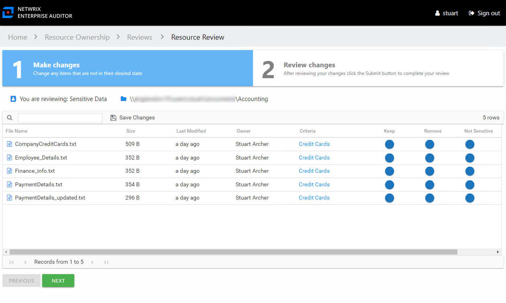
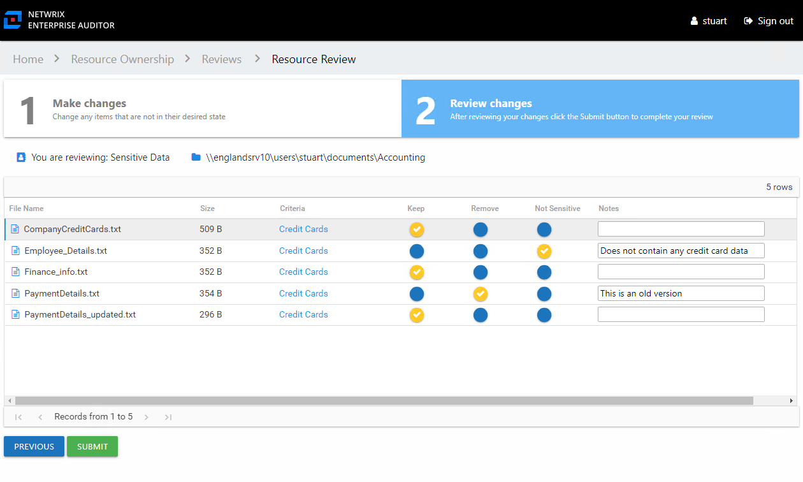

# Perform a Sensitive Data Review

A Sensitive Data review can be conducted for various types of data repository resources. Follow the steps to perform a Sensitive Data review.

**Step 1 –** On the Pending Reviews page, select the resource with a pending Sensitive Data review and click **Begin Review**. The Resource Review page opens to the 1 Make Changes tab.

The table displays files where potentially sensitive data has been found on the resource being reviewed:

* File Name – Name of file with extension
* Size – Size of the file
* Last Modified – Last modified date timestamp of the file from scanned the file details
* Owner – Owner of the file from scanned the file details
* Criteria – Name of the criteria with match hits found within the file. The hyperlink opens the Criteria Matches window. See the [Criteria Matches Window](../Window/CriteriaMatches#Criteria "Criteria Matches Window ") topic for additional information.

**Step 2 –** For each file listed, make a recommendation by clicking on the icon in either the Keep, Remove, or Not Sensitive column. Your selection is indicated by a yellow checkmark.

* Keep – Recommend no action should be taken
* Remove – Recommend that the file should be removed from the resource
* Not Sensitive – Recommend that the file does not contain sensitive data for the designated criteria

*Remember,* at any time you can save your recommendations and exit the review. It will remain pending until you submit all recommendations for this resource.

**Step 3 –** When the recommended changes are set as desired, click **Next**. The 2 Review changes tab opens in the Resource Review page.

**Step 4 –** This tab displays the table of files with your recommendations. Confirm your recommendations and optionally add notes to the Review Administrator. Owners are encouraged to leave notes explaining why the change is recommended.

**NOTE:** To make changes to your recommendations, you must return to the first tab. Click **Previous**.

**Step 5 –** When all recommendations are confirmed and the desire notes added, click **Submit**. A message displays stating that the review is complete. Click **OK** to close the message window.

The review for this resource is now complete. You will be redirected to the Pending Reviews page. Your recommended changes have been sent to the Review Administrator for approval and processing.