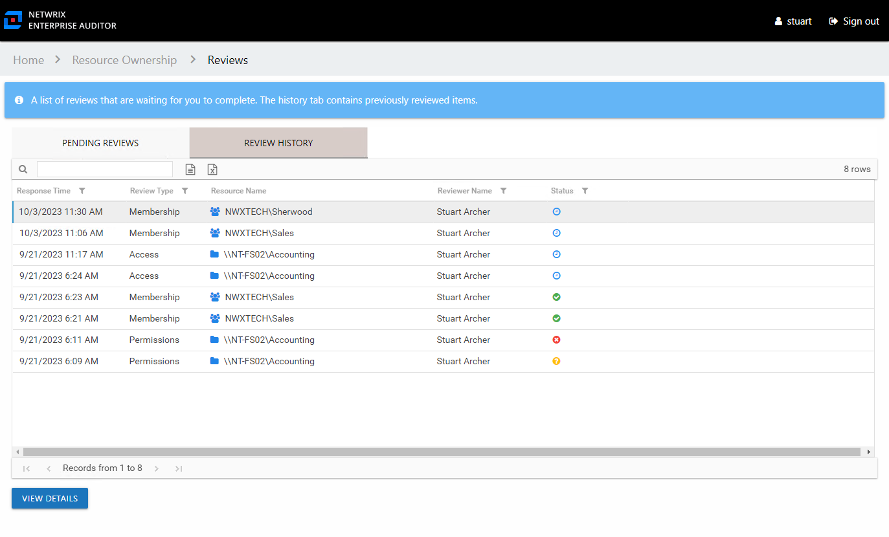
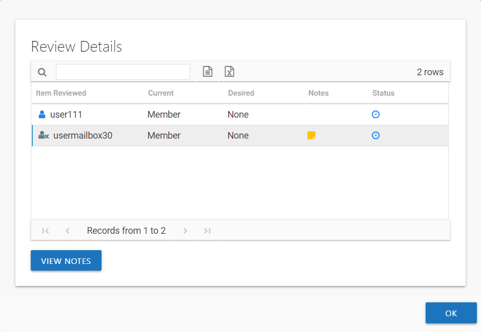

# Review History Page

The Review History page lists all completed review instances for your resources.

The information displayed in the table includes:

* Response Time – Date timestamp when the last review took place for the resource.
* Review Type – Type of review
* Resource Name – The icon indicates the type of resource. The resource name includes its location, such as the UNC path for a file system resource, the URL for SharePoint resource, or Group name (e.g., [Domain]\[Group]).
* Resource Description – Description or explanation of the resource as supplied by either the Ownership Administrator or the assigned owner
* Reviewer Name – Name of the assigned owner who performed the review
* Reviewer Account – sAMAccountName associated with the owner, as read from Active Directory
* Reviewer Title – Trustee's title as read from Active Directory
* Reviewer E-Mail – Trustee's email address as read from Active Directory
* Reviewer Department – Trustee's department as read from Active Directory
* Reviewer Employee ID – Trustee's employee ID as read from Active Directory
* Status – Icon indicates the decision provided by the Review Administrator: Accept, Decline, Defer, or Waiting. Hover over a status icon to display its tooltip.

The table data grid functions the same way as other table grids. See the [Data Grid Features](../../General/DataGrid "Data Grid Features") topic for additional information.

## Review Details Window

The View Details button at the bottom of the Review History page opens the Review Details window for a resource where changes were recommended.

The information displayed in the table includes:

* Item Reviewed – Item upon which changes were suggested by the owner
* Current – Current state of the item at the time of the review. It could be the type of access (for Access and Permissions reviews), being a member (for Membership reviews), or keeping the file (for Sensitive Data reviews).
* Desired – Change suggested by the owner. It could be the new type of access (for Access and Permissions reviews), removing membership (for Membership reviews), or remove or mark as Not Sensitive (for Sensitive Data reviews).
* Notes – An icon here indicates notes were entered by the owner. Select the item and click the **View Notes** button to open the View Notes window.
* Status – Icon indicates the decision provided by the Review Administrator: Accept, Decline, Defer, or Waiting. Hover over a status icon to display its tooltip.

Click **OK** to close the window.