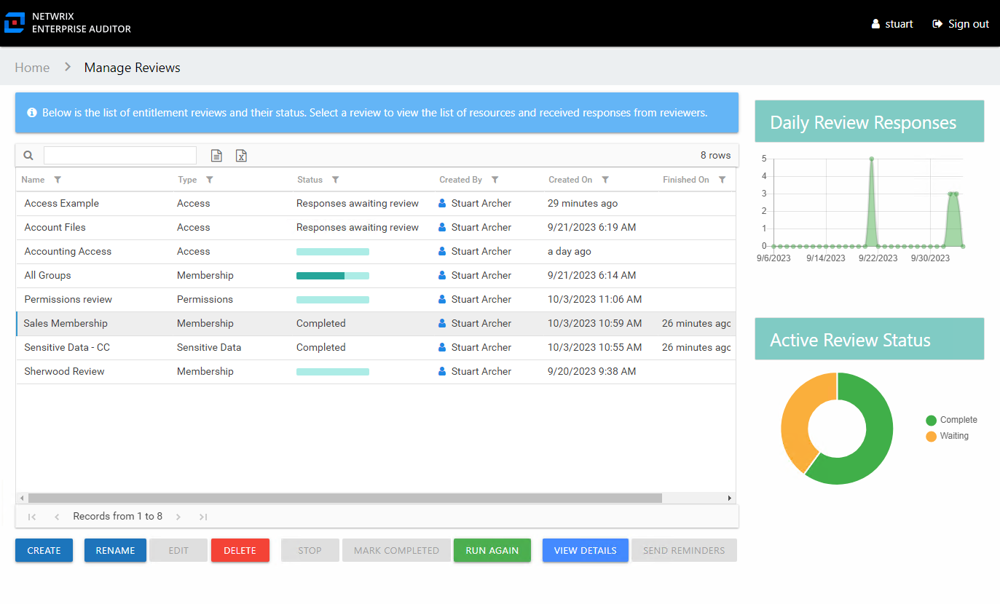
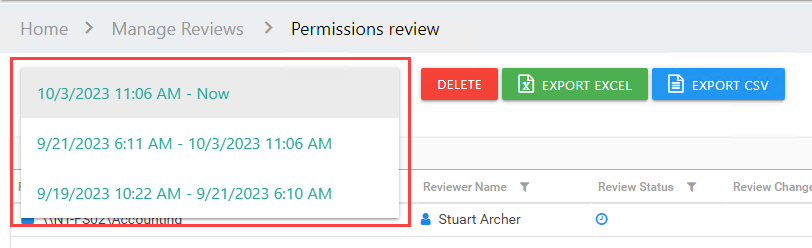

# Review Instances

After a review has been completed, it can be run again, which creates multiple instances of the review. Each instance is identified by date timestamps indicating its start and end times.

***RECOMMENDED:*** Prior to running another review instance, ensure the most up to date information is available to owners for review.

On the Manage Reviews page in the Resource Reviews interface, a review with a Completed status can be started again. Select the review and click **Run Again**. The Create Review wizard opens without the Review Type page. The review can be run as-is by navigating through the wizard with the **Next** buttons, or you can modify as desired. Completing the wizard process restarts the review. See the [Create Review Wizard](Wizard/Create "Create Review Wizard") topic for additional information.

Previous instances for a review can be viewed on the Review Details page. Select the instance from the drop-down menu to show the details for it. See the [Review Details Page](Interface#Review's "Review Details Page") topic for additional information.

## Sensitive Data Review Instances

If a file was marked as false positive during a previous review and approved by the Review Administrator, then the file was removed from the sensitive data reports and reviews for that criteria type. The file can reappear in reports and reviews if it matches the other sensitive data criteria.

Also, a file marked as a false positive in a previous review instance may appear in future review instances if Netwrix Access Analyzer (formerly Enterprise Auditor) finds that it has been modified and matches the selected criteria.