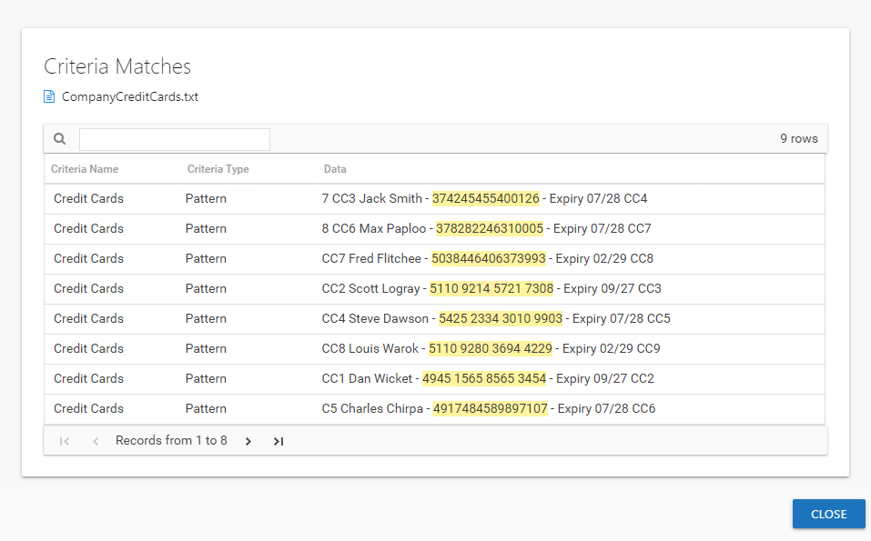

# Criteria Matches Window

The criteria type listed in a Sensitive Data review appears as a blue hyperlink. Click the hyperlink to open the Criteria Matches window.

The table displays the following information for each match found on the selected file:

* Criteria Name — Name of the criteria with match hits found within the file
* Criteria Type — Displays Pattern for pattern based matches (System Criteria), or the subject type based on Subject Profile matches (for example, Customer or Employee)
* Data — Displays the file content that contains the criteria match. This includes the 19 characters immediately preceding and following the criteria. The match is highlighted yellow.

  * If it's a Subject Profile criteria match, then it shows the attributes found (for example, Address or Phone)

Click **Close** to return to the review.