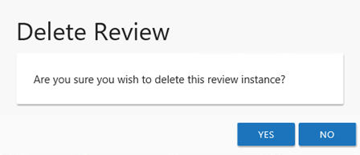

# Delete Review Window

The Delete Review window opens from either the [Manage Reviews Page](../Interface#Manage "Manage Reviews Page") or the [Review Details Page](../Interface#Review's "Review Details Page") of the Resource Reviews interface:

* [Delete Entire Review](#Delete "Delete Entire Review") — Deleting a review from the Manage Reviews page will delete all instances of the selected review
* [Delete Review Instance](#Delete2 "Delete Review Instance") — Deleting a review from the Review Details page will delete the selected review instance

## Delete Entire Review

Select the desired review on the Manage Reviews page and click **Delete**. The Delete Review window opens to confirm the action.

**CAUTION:** This will delete all instances of the selected review and all historical data associated with it.

Click **Yes** to complete the deletion. Click **No** to cancel it. The Delete Review window closes.

## Delete Review Instance

Select the desired review instance from the drop-down menu on the Review Details page and click **Delete**. The Delete Review window opens to confirm the action.

**CAUTION:** This will delete all historical data associated to the selected review instance.

Click **Yes** to complete the deletion. Click **No** to cancel it. The Delete Review window closes.