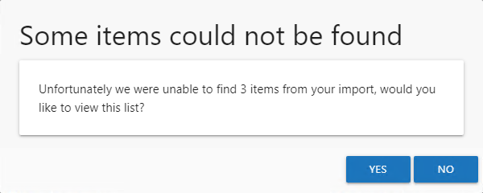
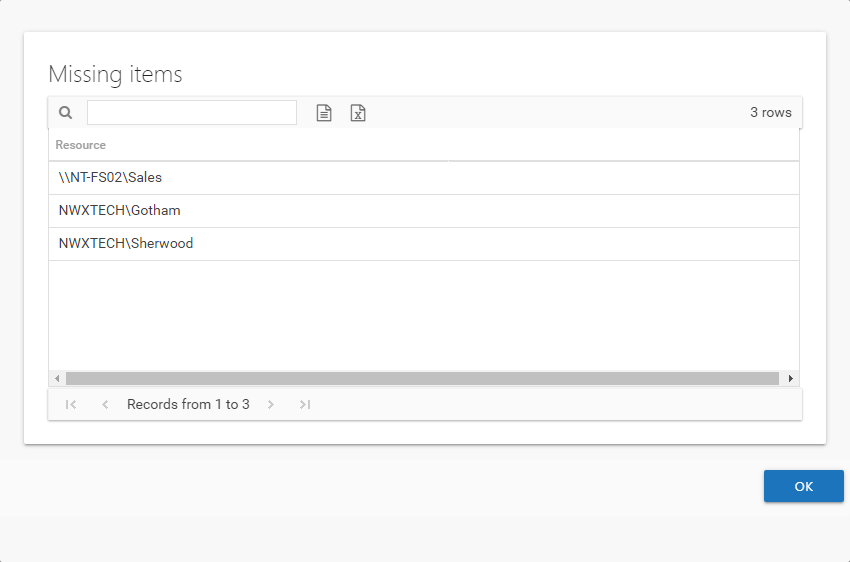

# Missing Items Window

The Some items could not be found message displays when importing a resource list in the Create Review or Edit Review wizards if items specified in the CSV file can not be found or are not valid for the review.

Click **Yes** to open the Missing Items window or click **No** to complete the import without viewing the missing items.

Review the list of resources. Items can be listed for multiple reasons:

* Resources that do not exist in the resource owners list
* Resources that exist in the resources owners list but the ownership has been declined
* Resources that are not valid selections for the selected review type

  * Membership – Resources that are not groups
  * Access / Permissions / Sensitive Data – Resources that are not file system, SharePoint, or DFS

* For Sensitive Data reviews, resources that do not have scan data available. This includes resources that only have sensitive data at a child folder level.

Click **OK** to close the window and complete the import of any valid resources.