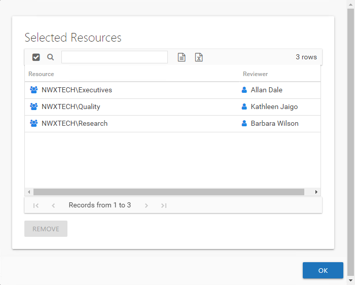

# Selected Resources Window

The Selected Resources window opens from the **View Selections** button in the [Create Review Wizard](../Wizard/Create "Create Review Wizard").

The table displays:

* Resource — The icon indicates the type of resource. The resource name includes its location, such as the UNC path for a file system resource, the URL for SharePoint resource, or Group name (e.g., [Domain]\[Group]).
* Reviewer — Primary owner assigned to the resource

Use the **Remove** button to remove a resource from this review. Click **OK** to close the window and complete the review creation.