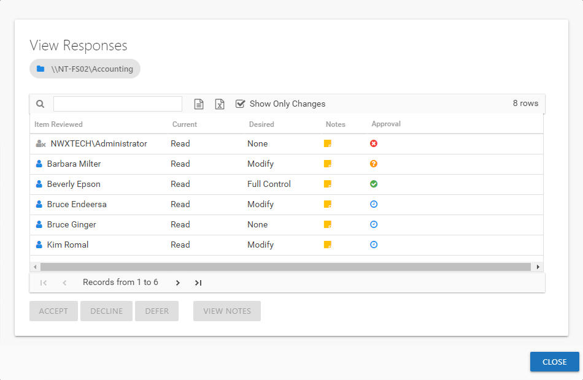

# View Responses Window

The View Responses window opens from the **View Response** button on the [Review Details Page](../Interface#Review's "Review Details Page") of the Resource Reviews interface. It displays all owner-recommended changes and notes for the selected resource.

The information displayed in the table includes:

* Item Reviewed — Item upon which changes were suggested by the owner
* Current — Current state of the item at the time of the review
* Desired — Change suggested by the owner
* Notes — Icon indicates a Note has been added. Click on the icon to read the attached note(s).
* Approval — Status of the Review Administrator's approval

  * Clock — Indicates waiting on the Review Administrator to make an official decision
  * Green Checkmark — Indicates the Review Administrator has approved the request
  * Red X — Indicates the Review Administrator has declined the request
  * Yellow Question mark — Indicates the Review Administrator has deferred taking action until a later time

The **Show Only Changes** checkbox is selected by default to show only the items with owner-recommended changes. If deselected, all items included in the review are displayed. When selecting the items with no changes in the grid, the change buttons at the bottom of the page are disabled.

**CAUTION:** If the Access Information Center has been configured to commit Active Directory changes, clicking **Accept** will commit the changes if all prerequisite for the review type have been met.

If the Access Information Center has been configured to commit Active Directory changes, the icon at the front of the Item Reviewed column is yellow. The selected action is automatically committed according to the type of review:

* Membership — Clicking accept removes group membership from the trustee
* Access and Permissions — If the prerequisite of resource based groups are set up for the resources, click accept will change group membership for the trustee. If the desire is to change access, the trustee is moved to the group with the desired access or permissions and removed from the group granting the current access or permissions. If the desire is to remove access, the trustee is removed from the group granting the current access or permissions.
* Sensitive Data — The only action that can be committed is to flag a file as a false positive for the selected criteria

See the [Data Collection & Automation Prerequisites](../Prerequisites#Workflow "Data Collection & Automation Prerequisites") topic for additional information.

The table data grid functions the same way as other table grids. See the [Data Grid Features](../../../General/DataGrid "Data Grid Features") topic for additional information.

Select an item in the table, and use the action buttons at the bottom to identify the decision:

| Button | Description |
| --- | --- |
| Accept | Accepts the selected owner-recommended change. If the Access Information Center has been configured to commit changes to Active Directory and the automation prerequisites have been met for the type of review, this change will be committed when you click the **Accept** button. |
| Decline | Declines, or rejects, the owner-recommended change. |
| Defer | Defers the owner-recommended change to a later time. |
| View Notes | Opens the Notes window for the selected item. |