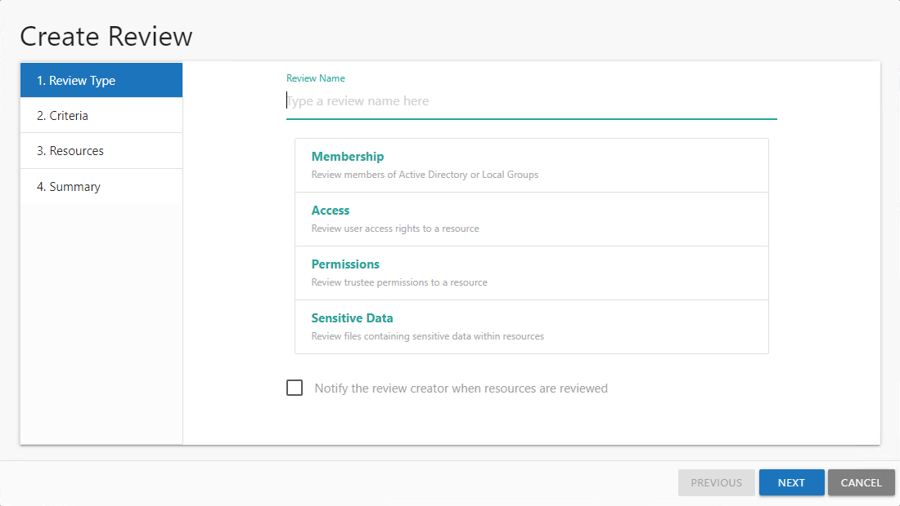
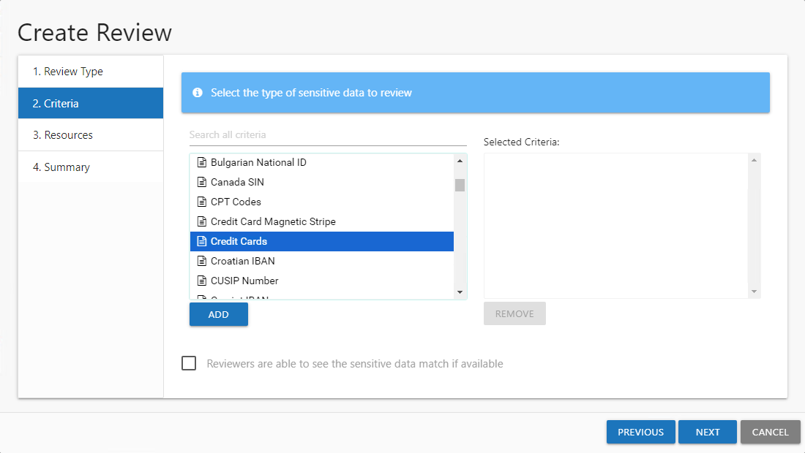
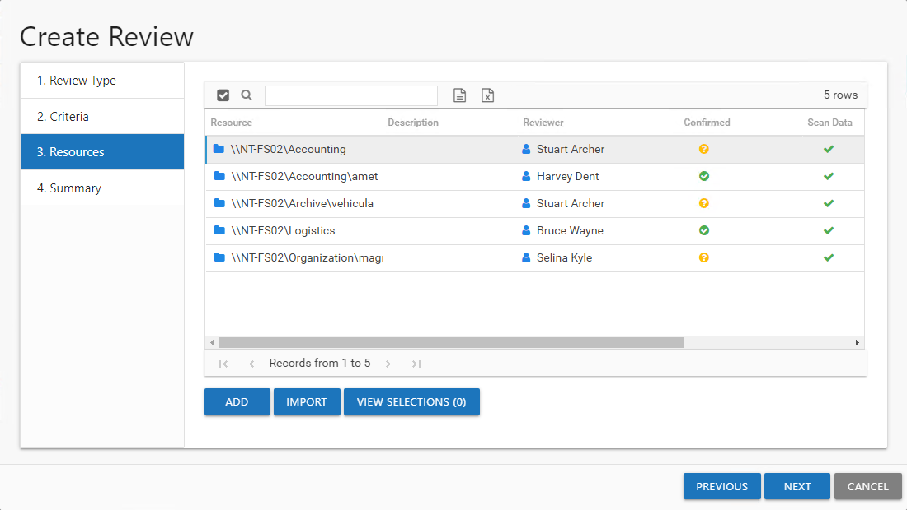
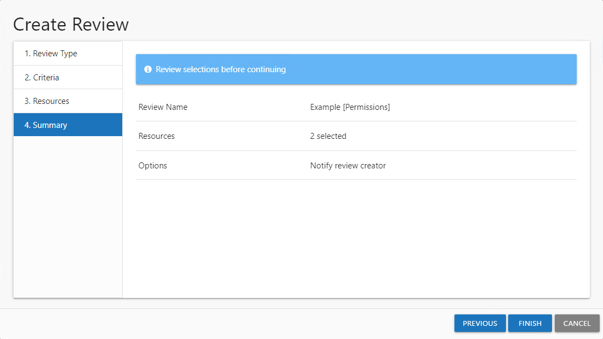
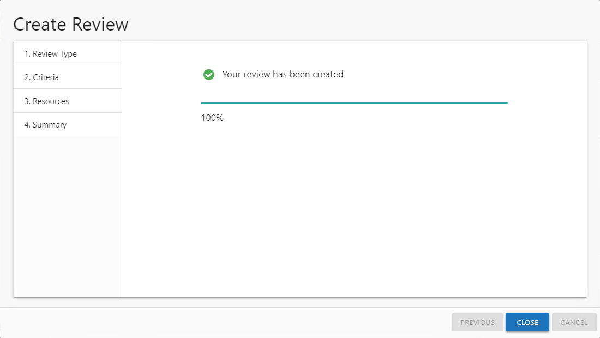

# Create Review Wizard

The Create Review wizard is opened with the **Create** button on the Resource Reviews interface. See the [Manage Reviews Page](../Interface#Manage "Manage Reviews Page") topic for additional information.

It contains four pages:

* 1. Review Type

  * Review Name — Visible only to Review Administrators
  * Select the type of review to be created:

    * Membership – Review group membership
    * Access – Review user access rights to resources
    * Permissions – Review trustee permissions to resources
    * Sensitive Data – Review files containing potentially sensitive data stored within resources

      **NOTE:** The Sensitive Data content within reports and reviews is visible to all users and roles. The Matches table in the report will only be populated for Console User with Security Team and Administrator roles.
  * Select whether to notify the review creator when the resources have been reviewed
  * For Access and Permissions reviews, indicate whether or not child resources with permission changes will be included.

    **NOTE:** This typically occurs due to broken inheritance and permissions being explicitly set. This option allows the entire resource hierarchy to be reviewed where permissions have been changed. It is not applicable to Membership and Sensitive Data reviews.
  * For Sensitive Data reviews, select if child resources that contain sensitive content should be included.
* 2. Criteria — Only applies to Sensitive Data reviews. Select the type of sensitive criteria to be reviewed.
* 3. Resources — Select resources to be included in the review
* 4. Summary — Preview of the review selections

See the [Create a Review](#Create "Create a Review") topic for additional information.

## Create a Review

Follow the steps to create a review.

**Step 1 –** On the Manage Reviews page, click Create. The Create Review wizard opens.

**Step 2 –** On the Review Type page, provide the following information and click **Next**:

* Review Name — Enter a unique, descriptive name for the review. The review name is only visible to Review Administrators.
* Select Type — Reviews are limited to one type. Select the type of review from the buttons provided:

  * Membership – Review group membership
  * Access – Review user access rights to resources
  * Permissions – Review trustee permissions to resources
  * Sensitive Data – Review files containing potentially sensitive data stored within resources
* Notify the review creator when resources are reviewed — When selected, an email is sent to the review creator when the review has been completed by the resource owner. If the review contains multiple resources, an email is sent when each resource is reviewed. See the [Resource Reviewed Email](../Email/ResourceReviewed "Resource Reviewed Email") topic for additional information.

  **NOTE:** This option is not available for the Builtin Administrator account as it has no email to receive notifications.
* Include children with permission changes — When checked, this option automatically includes any child folders and resources in the review that have different permissions than the selected resource.
* Include children with sensitive content — When checked, this option automatically includes any child folders and resources in the review that contain sensitive content.

**NOTE:** If creating a Sensitive Data review, continue to Step 3. For all other review types, skip to Step 5.

**Step 3 –** On the Criteria page, select the types of sensitive criteria to include in the Sensitive Data review from the list on the left and click **Add**. Multiple items can be selected together by using the **Ctrl** or **Shift** key with mouse click combinations. The selected criteria is added to the Selected Criteria list. Repeat this until you have all required criteria selected. To remove a criteria, select it in the Selected Criteria list and click **Remove**.

**NOTE:** The sensitive data criteria listed is limited to what is configured to be collected by the Netwrix Access Analyzer (formerly Enterprise Auditor) data collection scans.

**Step 4 –** Optionally check the **Reviewers are able to see the sensitive data match if available** option to allow the owner with Console Access roles of Security Team or Administrator to view potentially sensitive data within the review. Click **Next** to continue.

**CAUTION:** If this option is checked, but the data has not been collected with matches stored by Netwrix Access Analyzer (formerly Enterprise Auditor) for all of the resources selected in Step 5, the One or more resources selected have not been scanned error occurs. The Create Review wizard will not allow the review to be created until those resources have been removed or the option unchecked.

**Step 5 –** On the Resources page, select the resources to be included in the review. The Search feature is available to filter the list of available resource that match the type of review being created.

* The table displays the following information:

  * Resources — The icon indicates the type of resource. The resource name includes its location, such as the UNC path for a file system resource, the URL for SharePoint resource, or Group name (e.g., [Domain]\[Group]).
  * Description — Description or explanation of the resource as supplied by either the Ownership Administrator or the assigned owner
  * Reviewer — Primary owner assigned to the resource
  * Confirmed — Indicates whether or not the assigned owner has confirmed ownership of that resource. Tool-tips display when hovering over the icons indicating whether the resource ownership has been confirmed, declined, pending response, or that a confirmation has not been requested.
  * Scan Data — A checkmark indicates the resource has been scanned. Only resources with scan data can be included in a review.
  * Active Review — Indicates whether or not there is a pending review
* Select the desired resource(s) and click **Add**. The **View Selections** button indicates how many resources have been selected. Click the button to open the Selected Resources window, where you can view and modify the selections. See the [Selected Resources Window](../Window/SelectedResources "Selected Resources Window") topic for additional information.
* Alternatively you can import a list of resources from a CSV file. Click the **Import** button and then select the CSV file. A message displays if items are not found or not valid for the review. Any valid resources are selected and can be viewed in the Selected Resources window.  See the [Missing Items Window](../Window/MissingItems "Missing Items Window") topic for additional information

  The CSV file must use the following format for the resources:

  * File system: `\\HOST\Share\file`
  * SharePoint: `https://abc/def`
  * Groups: `Domain\GroupName`
  * Distribution lists: `Name@domain.com`
* Once the desired resources have been selected, click **Next**.

**Step 6 –** On the Summary page, review the settings and click **Next**. The Access Information Center begins to create the review.

**Step 7 –** The action status displays on the page. When the review has been created (100%), click **Close**. The Create Review wizard closes.

The new review displays in the table on the Manage Reviews page. An email was sent to the primary owner assigned to the resource(s) in this review. By default, the application is configured to send notifications only to the primary owner. However, this can be customized on the Configuration > Notifications page to send notifications to all assigned owners. See the [Notifications Page](../../Admin/Configuration/Notifications "Notifications Page") topic for additional information.