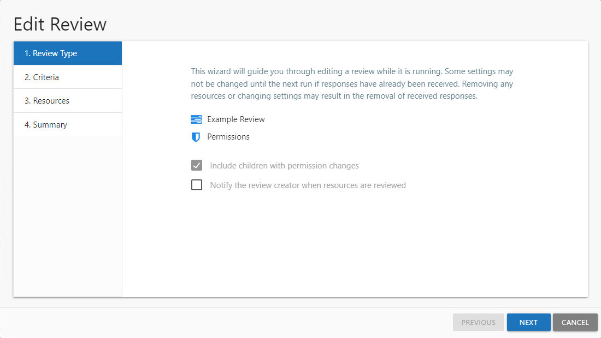
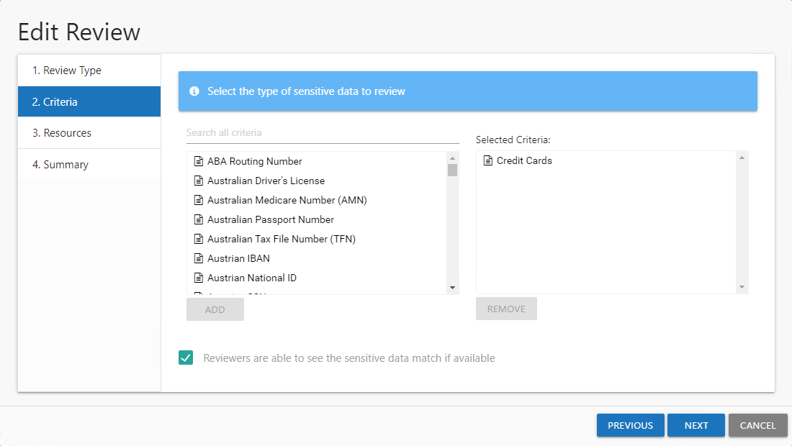
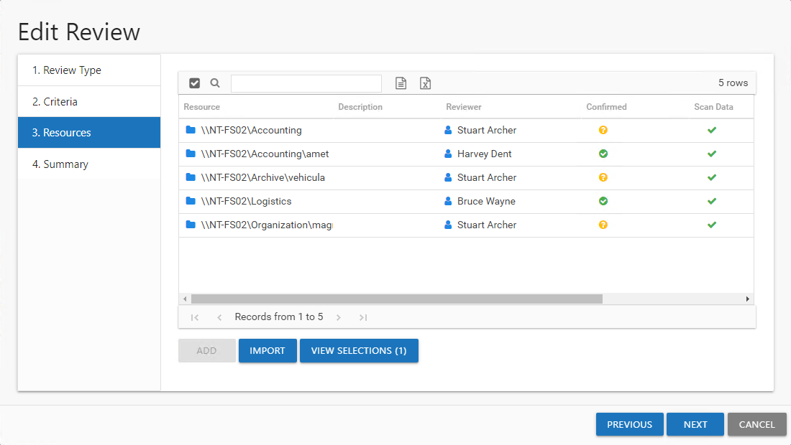
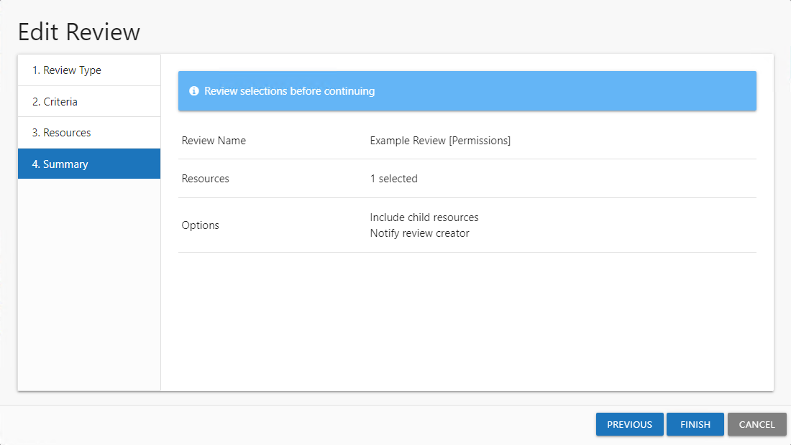
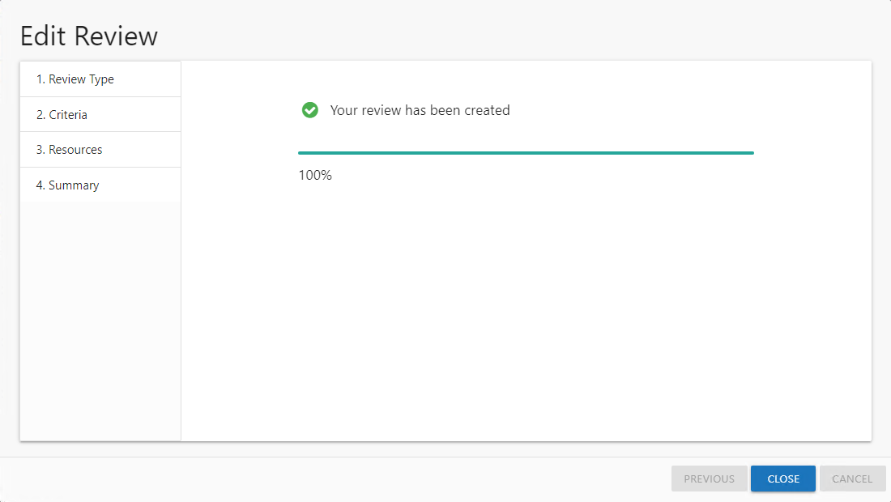

# Edit Review Wizard

The Edit Review wizard is opened with the **Edit** button on the Resource Reviews interface. See the [Manage Reviews Page](../Interface#Manage "Manage Reviews Page") topic for additional information.

It contains four pages:

* 1. Review Type — Select whether to notify the review creator when the resources have been reviewed. The review type and name cannot be changed.
* 2. Criteria — Only applies to Sensitive Data reviews. Update the sensitive criteria to be reviewed.
* 3. Resources — Modify the list of resources included in the review
* 4. Summary — Preview of the review selections

See the [Edit a Review](#Edit "Edit a Review") topic for additional information.

## Edit a Review

Follow the steps to edit an active review.

**Step 1 –** On the Manage Reviews page, click **Edit**. The Edit Review wizard opens.

**Step 2 –** On the Review Type page, configure the notify review creator option as required. The Review Name and type are shown on the page but can not be edited. For Permissions, Access, and Sensitive Data reviews, the selection of the include children option is also shown, but can not be edited.

* Notify the review creator when resources are reviewed — When selected, an email is sent to the review creator when the review has been completed by the resource owner. If the review contains multiple resources, an email is sent when each resource is reviewed. See the [Resource Reviewed Email](../Email/ResourceReviewed "Resource Reviewed Email") topic for additional information.

**NOTE:** If creating a Sensitive Data review, continue to Step 3. For all other review types, skip to Step 5.

**Step 3 –** On the Criteria page, you can modify the selected types of sensitive criteria to include in the Sensitive Data review if no responses have been received. If responses for one or more resources have already been submitted you can not add or remove criteria.

* To add a new criteria, select the criteria to include from the list on the left and click **Add**. Multiple items can be selected together by using the **Ctrl** or **Shift** key with mouse click combinations. The selected criteria is added to the Selected Criteria list.
* To remove a criteria, select the criteria in the Selected Criteria list on the right and click **Remove**

**NOTE:** The sensitive data criteria listed is limited to what is configured to be collected by the Netwrix Access Analyzer (formerly Enterprise Auditor) data collection scans.

**Step 4 –** Optionally edit the selection of the **Reviewers are able to see the sensitive data match if available** option to allow the owner with Console Access roles of Security Team or Administrator to view potentially sensitive data within the review. Click **Next** to continue.

**CAUTION:** If this option is checked, but the data has not been collected with matches stored by Netwrix Access Analyzer (formerly Enterprise Auditor) for all of the resources selected in Step 5, the “One or more resources selected have not been scanned” error occurs. The Create Review wizard will not allow the review to be created until those resources have been removed or the option unchecked.

**Step 5 –** On the Resources page, modify the list of resources to be included in the review.

**NOTE:** If the include child resources option was enabled during the review creation, then adding or removing parent resources from the review also adds or removes their children.

* The table displays the following information:

  * Resources — The icon indicates the type of resource. The resource name includes its location, such as the UNC path for a file system resource, the URL for SharePoint resource, or Group name (e.g., [Domain]\[Group]).
  * Description — Description or explanation of the resource as supplied by either the Ownership Administrator or the assigned owner
  * Reviewer — Primary owner assigned to the resource
  * Confirmed — Indicates whether or not the assigned owner has confirmed ownership of that resource. Tool-tips display when hovering over the icons indicating whether the resource ownership has been confirmed, declined, pending response, or that a confirmation has not been requested.
  * Scan Data — A checkmark indicates the resource has been scanned. Only resources with scan data can be included in a review.
  * Active Review — Indicates whether or not there is a pending review
* Select the desired resource(s) and click **Add**. The **View Selections** button indicates how many resources have been selected. Click the button to open the Selected Resources window, where you can view and modify the selections. See the [Selected Resources Window](../Window/SelectedResources "Selected Resources Window") topic for additional information.
* Alternatively you can import a list of resources from a CSV file. Click the **Import** button and then select the CSV file. A message displays if items are not found or not valid for the review. Any valid resources are selected and can be viewed in the Selected Resources window.  See the [Missing Items Window](../Window/MissingItems "Missing Items Window") topic for additional information

  The CSV file must use the following format for the resources:

  * File system: `\\HOST\Share\file`
  * SharePoint: `https://abc/def`
  * Groups: `Domain\GroupName`
  * Distribution lists: `Name@domain.com`
* Once the desired resources have been selected, click **Next**.

**Step 6 –** On the Summary page, review the updated settings and click **Next**. The Access Information Center begins to update the review.

**Step 7 –** The action status displays on the page. When the review has been updated (100%), click **Close**. The Edit Review wizard closes.

The updates to the review are saved. If new resources were added, notifications have been sent to the resource owners.